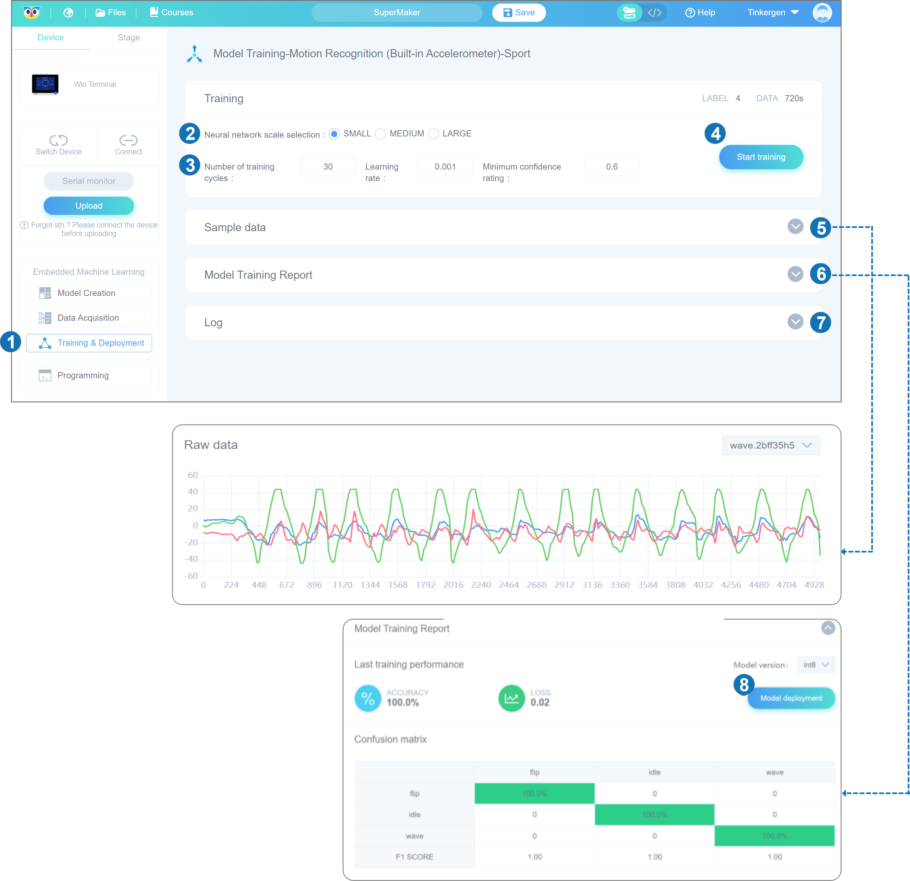
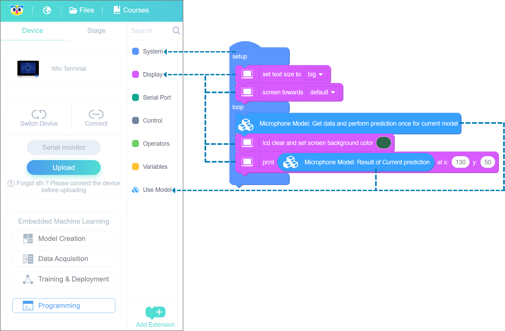

# Lesson 01 Introduction to TinyML using Wio Terminal and Codecraft
## Theory 
### Machine Learning and Deep Learning
Machine learning is a branch of Artificial Intelligence (AI) that focuses on building applications that learn from data and improve their accuracy over time. This process is carried out without using traditional rule-based programming. Machine learning enables machines to work by observing, classifying, and learning from mistakes just like human beings. Deep learning is a subset of machine learning that uses deep artificial neural networks (hence the name) to learn from large amounts of data.

Artificial Neural Networks (ANNs) are the network of neurons that attempt to emulate a composition human brain. ANNs are created by computer programming which behaves like the brain cells that connect to each other. 
In order to learn ANNs, you need to prepare a tremendous amount of information which is called "Train Set". When you are trying to teach an ANN how to distinguish cats and dogs, the train set would provide thousands of images tagged as dogs and cats that allow the neural network to learn. Once a neural network is trained with a significant amount of data, it will be able to classify future data based on what it thinks to see (or hear, depending on the data set) throughout the different units. During the training period, the output of the machine is compared to the human-provided description of what should be observed. If they are the same, the machine is validated. If it's incorrect, it uses backpropagation to adjust its learning. Back Propagation is the process of going back through the layers to tweak the mathematical equation. Known as "Deep Learning", this is what makes a network intelligent.

#### What is TinyMl and why is TinyML important?
Normally, Deep Neural Networks require rather powerful computing resources to be trained and deployed. However, a branch of ML on the Edge or Embedded Machine Learning called TinyML has appeared recently. It represents a technique (or field of study) in machine learning and embedded systems that explores which machine-learning applications (once reduced, optimized, and integrated) can be run on devices as small as microcontrollers.

The ML, as you might have guessed stands for Machine Learning. Tiny in TinyML means that the ML models are optimized to run on very low-power and small-footprint devices such as various microcontrollers (MCUs).
Embedded devices come in all sorts of shapes and sizes, starting from “embedded supercomputer” Nvidia Jetson Xavier AGX to the tiniest of microcontrollers, for example, ESP32 or Cortex M0.

The following figure shows the GeeekNET ESP 32 development board.

**Why embedded ML on microcontrollers is classified in a special category and even given its own cool name?**

The answer is that it comes with its own set of advantages and limitations. The attraction of TinyML is in fact that MCUs are ubiquitous, small, consume small amounts of energy, and are comparatively cheap. Take ARM Cortex M0+  and the little Seeeduino XIAO board which is built around it – the board is as small as a thumb(20×17.5mm)and it consumes only 1.33 mAh of power (which means it can work ~112 hours on a 150 mA battery. (This time can be increased even further if the device is put in deep sleep). It costs as little as 5 USD.

Thanks to recent improvements in model optimization and the emergence of frameworks specifically created for running machine learning model inference on microcontrollers. It has become possible to give more intelligence to these tiny devices. We now can deploy neural networks on microcontrollers for **audio scene recognition** (for example, elephant activity or sound of breaking glass), **hot-word detection** (to activate device with a specific phrase) or even for simple **image recognition** tasks. The devices with embedded microcontrollers can be used to give new life and meaning to old sensors.

With Codecraft and Wio Terminal, it is now possible to experience the entire process of embedded machine learning without having to deal with a complex programming environment and extensive programming knowledge.
## Preparation
### Wio Terminal
Wio Terminal is the perfect tool for getting started with IoT and TinyML. It is designed and produced by Seeed Studio and is well supported by various TinyML reasoning frameworks.

The Wio Terminal is using an ATSAMD51P19 microcontroller with ARM Cortex-M4F running at 120MHz (boost up to 200MHz), 4MB of external flash memory, and 192KB of RAM. Wireless connectivity with Realtek RTL8720DN support. It is compatible with Arduino and MicroPython. It supports both Bluetooth and Wi-Fi providing a solid foundation for IoT projects. There is a 2.4-inch LCD screen on Wio Terminal, an on-board IMU (LIS3DHTR), microphone, buzzer, microSD card slot, light sensor, and IR emitter (IR 940nm). Most importantly there are two multi-functional Grove ports onboard for the Grove ecosystem and Raspberry Pi compatible 40-pin GPIO pins for additional add-on support.
​
### Codecraft
Software-wise we will be using Codecraft, a graphical programming platform. Powered by Edge Impulse, TinyML is easily accessible by beginners using Codecraft. It provides a beginner-friendly (yet powerful) web interface and toolkit for the whole TinyMl pipeline starting from data collection all the way up to model deployment and extensive use.
Codecraft is a user-friendly development platform for machine learning on edge devices.
​

**So, let's quickly go through how to use it to achieve our machine learning journey.**
 
Click the icon of Wio Terminal in Codecraft home screen to enter Wio Terminal's embedded machine learning interface.

Then

#### ​

#### 1. Model Creation

 **Model Creation:** The first step of TinyML. Click "Model Creation" to see the interface of "Creating new models for embedded machine learning".

 **Return to Codecraft Home Page:** You can click on it to return back to the Codecraft Home Page. If you have not saved the current program, it will prompt you to save it before you leave.

 **Language:** Upon clicking this, the language options appear. You can change the language here.

 **Files:** You can create a new online project or open a local project. You can save your projects to the cloud from a computer following the on-screen instruction.

 **Course Examples:** Here you can check the courses about Codecraft.

 **Save Files Online:** You can modify your project names and save them to the cloud. (Codecraft should be connected to the internet and logged in with your Codecraft account).  

 **Blocks/Codes:** You can toggle between blocks and code. The Programming language being used here is C.

 **Help:** We always appreciate your suggestions for Codecraft. We can't do better without your involvement.

 **Login:** You can visit your cloud projects, account settings, my invitation code, and log out.  If you are not logged in, it will prompt you.

 **Model framework according to the sensor:** You can create a model here by selecting the sensor you are going to use. Click the corresponding icon to create a model using a particular sensor. After creating a new model, the interface will automatically jump to the "Data Acquisition" interface.

 **My models:** You can click here and view all the models you have created.
#### 2. Data Acquisition

 **Connect:** You can connect your device here.

 **Upload: ** Click here to upload your program.

  **Data Acquisition:** The second step of TinyML.

 **Catalogue Area:** You can select the blocks you need by category here.

 **Sample Data blocks:** You can get the "default data acquisition program" and blocks related to sample data.

 **Default data acquisition program:** You can upload the default data acquisition program directly to start the data acquisition journey.

 **Operation on model:** Here You can rename and delete the model and its data.

 **Introduction to data collection steps:** Clicking here will show a pop-up window with the details of the data collection process.

 **Labels:** There are default labels on the right side of the data acquisition interface. You can add and delete labels. To **Add a** custom label: Click "+". **To Delete** the label: mouse over the label, an "x" will appear in the upper left corner of the label, click the "x" to delete it. To **Modify** the label: click on the label that will appear to modify the label pop-up window.

 **Operation on data:** You can delete, rename and download data here.
#### 3. Training & Deployment:

 **Training & Deployment:** The third step of TinyML.

 **Neural network scale:** You can select the suitable neural network size: one of small, medium, and large.

 **Parameters:** Codecraft provides default parameter values for each scale of the model. you can set the number of training cycles (positive integer), the learning rate (0~1 number), and the minimum confidence rating(0~1 number) by yourself.

 **Start training:** Click "Start Training" to train the model.

 **Sample data**: The collected data samples can be observed here.

 **Model Training Report:** You can observe the training results including the accuracy, loss, and performance of the model on Wio Terminal. If the training results are not satisfactory, you can go back to the first step of training the model and select another size of neural network or adjust the parameter settings and train again until you get a model with satisfactory results.

 **Log:** During training, the "Log" screen displays a training log. By observing the "Log", you can deduce the model performance.

 **Model deployment:** Click here to deploy the ideal model.
#### 4. Programming

You can complete the program by dragging and dropping the blocks. The course also provides the most concise sample code. You can find the corresponding blocks according to the block color.
### Example Tutorials
To help understand the use of embedded machine learning. We provide 7 template projects. You can learn how to use Codecraft for embedded machine learning based on these template model examples. We hope these examples can help you in building more interesting applications.
​