# 第2课 使用内置加速度计进行运动识别

## 项目概述

在这节课中，我们将要进行一个手势识别的任务，也就是尝试运用 Wio Terminal 的内置的三轴加速度计来识别三种手势，包括翻转，挥动以及静止。

如果使用基于算法的传统编程手段，这将会非常棘手。对于传统编程的机器来说，手势必须以完全相同的方式执行才能被识别，而这在现实当中几乎不可能，其中涉及众多因素，以运动因素为例：我们手势的摆动速度、转动角度以及静置方向，严格意义上来说都不会完全相同，而这些微小变化都需要使用传统编程来制订一套规则以减少识别错误。所以如果同样使用传统编程来解决这个手势识别问题时，就需要为每种操作模式制定数百条不同的规则。

值得庆幸的是，**机器学习**可以非常简单的处理这些变化，而不需要冗杂的规则程序。

### 预期结果

Wio Terminal 实时显示当前 Wio Terminal 动作的识别结果：翻转、挥动以及静止。

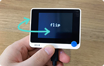
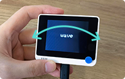
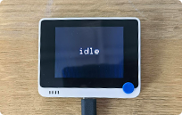

### 准备工作

硬件需求：Wio Terminal

连接方法：

## 背景知识

可能正如你想的那样，加速度计是用来测量一个物体加速度的传感器，它的输出结果来自物体的速度变化。加速度计可以测量速度随时间的变化，常见的加速度为重力加速度，一个重力加速度等于 9.8 米每平方秒（m/s2），表示每秒钟就有 9.8 米每秒（m/s）的速度在增加或减少。

世界上有很多种加速度的计算测量方法，最早的加速度是由一个机械建筑演变而来的。第一个加速度计是阿特伍德机，它是由英国物理学家乔治·阿特伍德发明的。

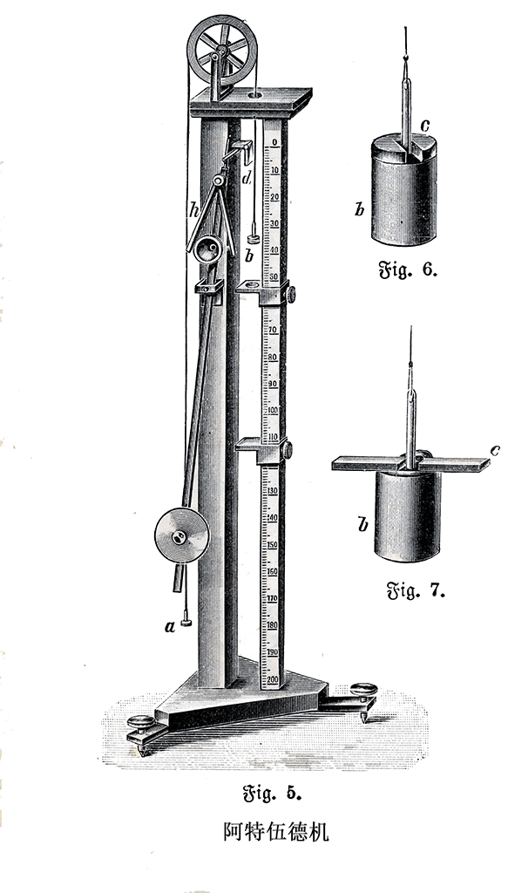

加速度计通常由质量块、阻尼器、弹性元件、敏感元件和适调电路等部分组成，根据传感器敏感元件的不同，加速度计可以分为电容式、压电式等；根据输入轴又可以分为单轴、双轴和三轴。一般使用在手机中的加速度计是微机电系统（Micro-electromechanical systems 简称  MEMS）加速度计，我们在 Wio Terminal 中使用的是就三轴数字加速度计（LIS3DHTR）。

加速度计的原理一般情况下是通过传感器感知受到力的作用，再经过内部电路（电容变化）将受到的力转换为电信号输出。比如 MEMS 加速度计，它的模型其实是一个由弹簧质量块组成的阻尼系统，当质量块由于惯性作用压缩弹簧的时候会产生一个弹性力，将弹簧与内部电路相连，电容会随着弹簧的移动而变化，通过胡克定律和电容变化我们可以知道弹性力与电信号的关系，而后用牛顿第二定律即可用电信号表示加速度。

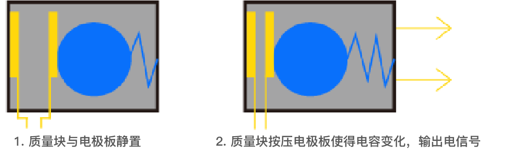

三轴数字加速度计在原理上与 MEMS 加速度计大同小异，另外可以让它测量更加精准的原因是它同时拥有三个传感器来识别三个轴向力的作用。

## 练习与实践

### 课程步骤

1. 创建与选择模型
1. 数据采集
1. 训练与部署
1. 使用与编程

### 步骤1、创建与选择模型

#### 1.1 建立“运动识别（内置加速度计）”模块

点击“创建与选择模型”，然后点击“内置加速度计识别动作”，如下面步骤 1 和步骤 2 所示

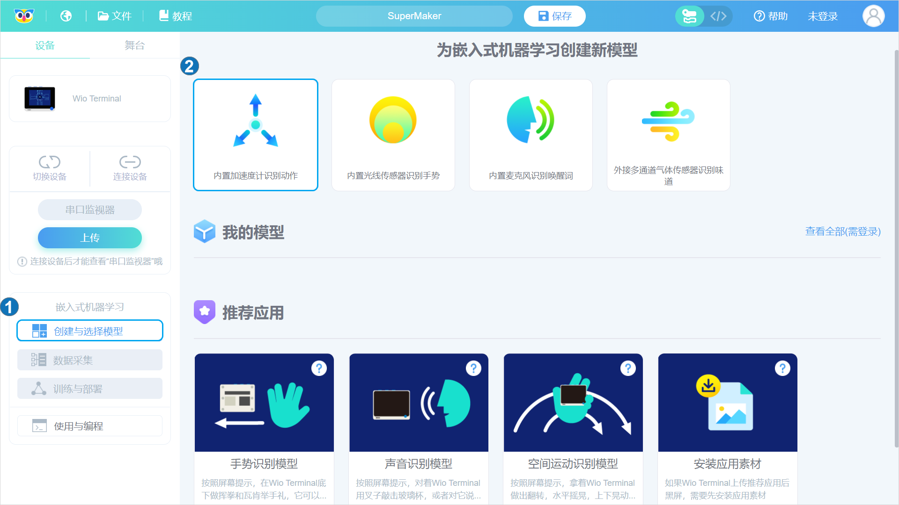

给新建的模型命名

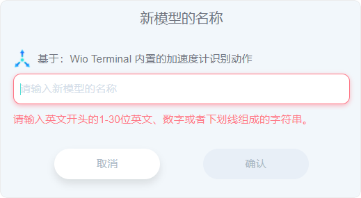

点击“确认”就会自动跳转到数据采集界面。

### 步骤 2、 数据采集

#### 2.1 默认标签

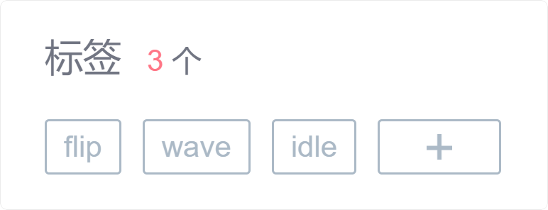

#### 2.2 连接设备并上传 Codecraft 中的默认数据采集程序

Wio Terminal 连接后，在 Codecraft 界面，点击"上传"即可上传默认数据采集程序。

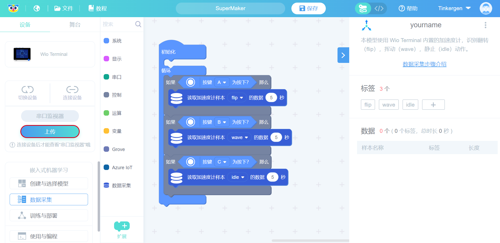

如下图所示将出现一个“上传”弹出窗口。选择与当前 Wio Terminal 对应的串口号（不一定为下图的 COM14），点击“确定”按钮。

弹窗会提示正在上传程序，请稍候...

通常上传需要 10 秒钟。 程序上传后，“上传成功”的窗口将出现在如下图所示的屏幕上

点击“我知道了”关闭上传成功弹窗，返回编程界面。

**警告**

在网页版 Codecraft 中，如果您没有安装或运行设备助手，您可能会收到下图中的消息。

查看此页面以获取更多信息：[下载、安装和“设备助手”使用](https://www.yuque.com/tinkergen-help-en/codecraft/assistant)。

#### 2.3 数据采集

在右上角的超链接中，您将找到数据采集的分步介绍。请按照说明收集数据。

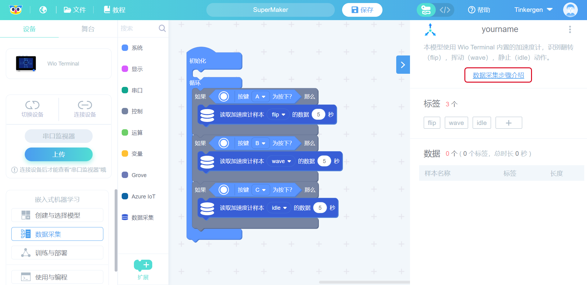

注意：

- Wio Terminal 按钮位置。
- 动画是已经加速过的，实际动作可能有所缓慢。
- 请注意红色提示。
- 将光标指向描述文本以获得更详细的内容。

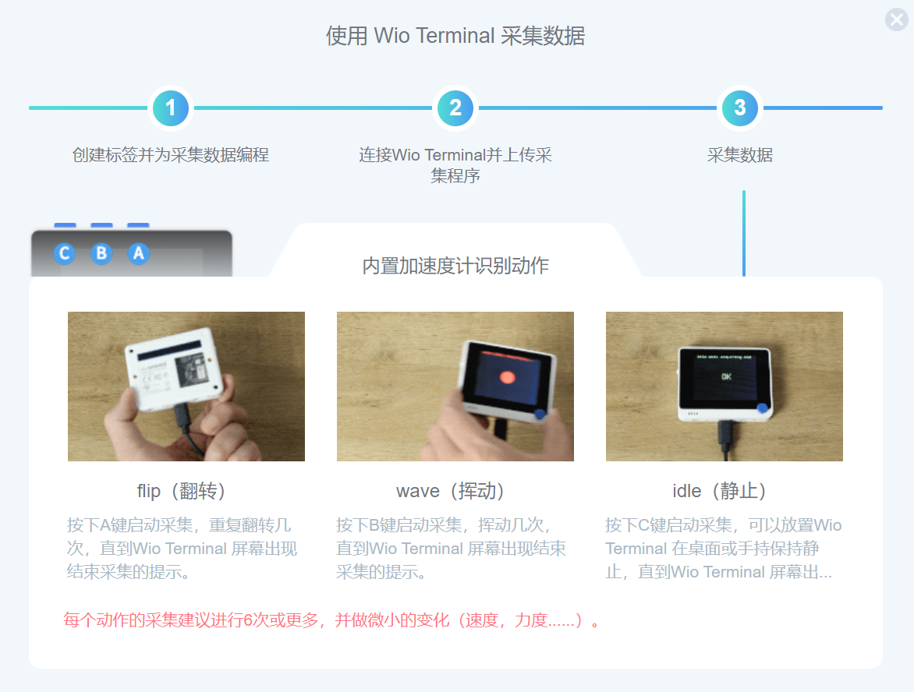

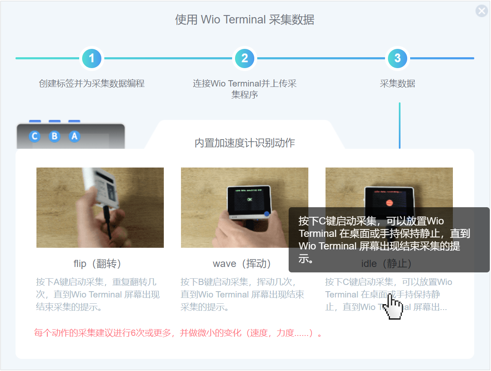

让我们开始根据 Wio Terminal 显示图标来完成数据采集。

这个信号表示正在 Wio Terminal 收集数据。

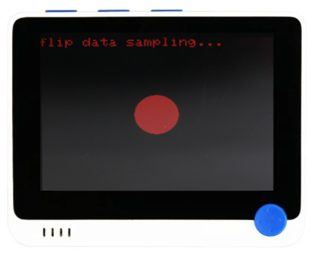

OK表示数据收集完成。

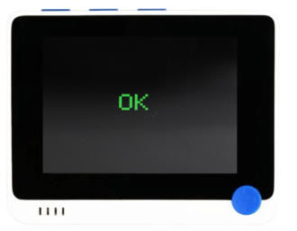

Wio Terminal 虽然显示数据采集完成，但 CodeCraft 仍在上传数据，数据从 Wio Terminal 传输到 CodeCraft 需要 1~2s。

至此，数据全部采集完成。

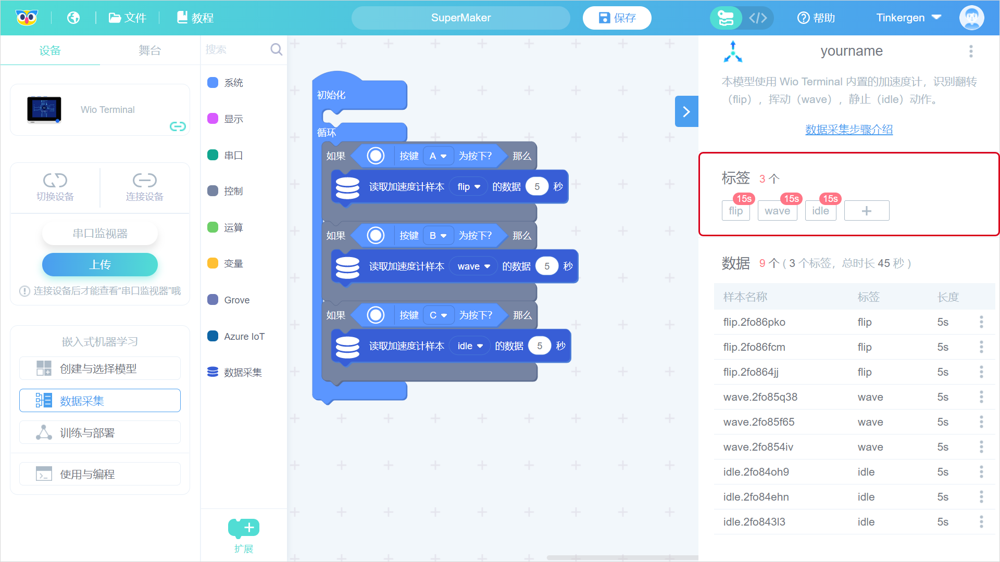

单击“训练与部署”。

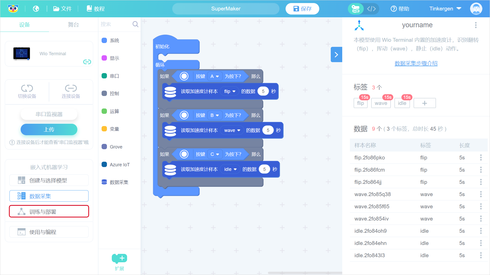

### 步骤 3. 训练与部署

#### 3.1 设置神经网络和参数

选择你觉得合适的神经网络规模：小型、中型、大型。

接着设置参数、训练周期数（正整数）、学习率（从 0 到 1 的数字）和最小置信度（从 0 到 1 的数字）。初始页面已提供一些默认参数值。

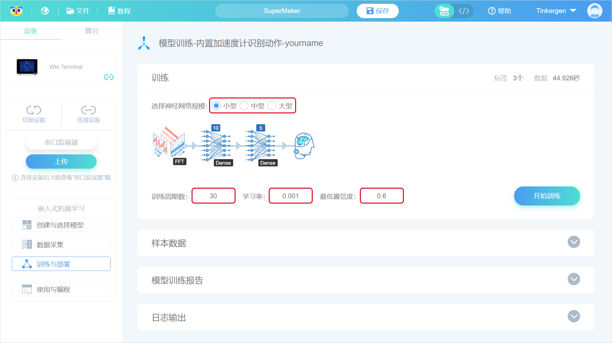

#### 3.2 开始训练模型

点击“开始训练”。

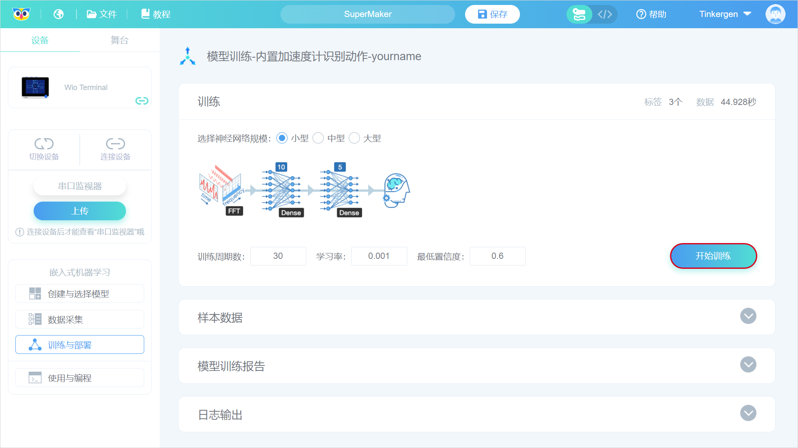

当您点击“开始训练”时，界面会显示“拼命加载中...”。

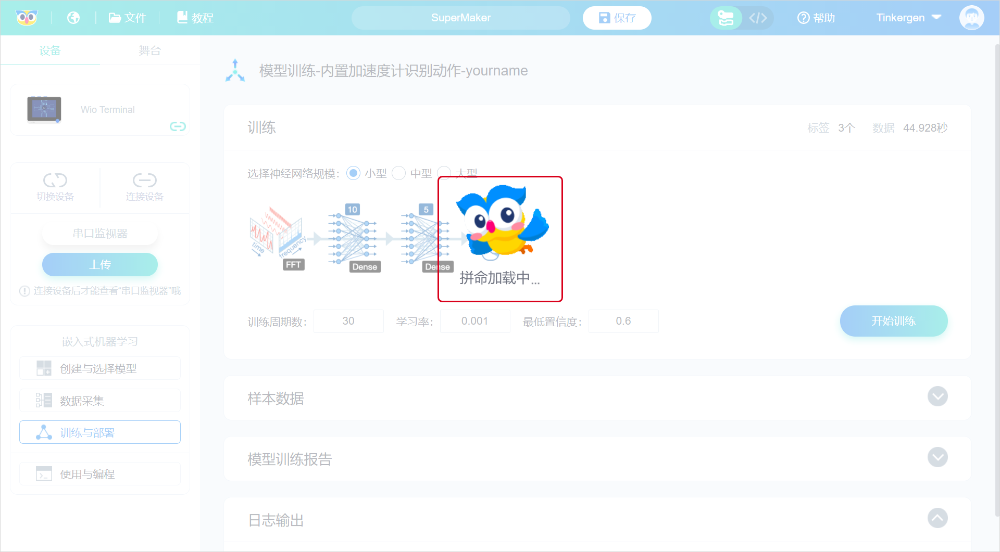

“拼命加载中...”的持续时间取决于所选神经网络的规模（小型、中型、大型）和训练周期数。通常来说，网络规模和训练周期数越大，所需的时间就越长。

您还可以通过观察“日志输出”来推断等待时间。下图中，“Epoch: 8/30”表示训练总轮数为30轮且已经训练了8轮。

等待加载完后，“日志输出”中会出现“TrainModel Job completed”表示训练完成，界面上会出现“模型训练报告”。

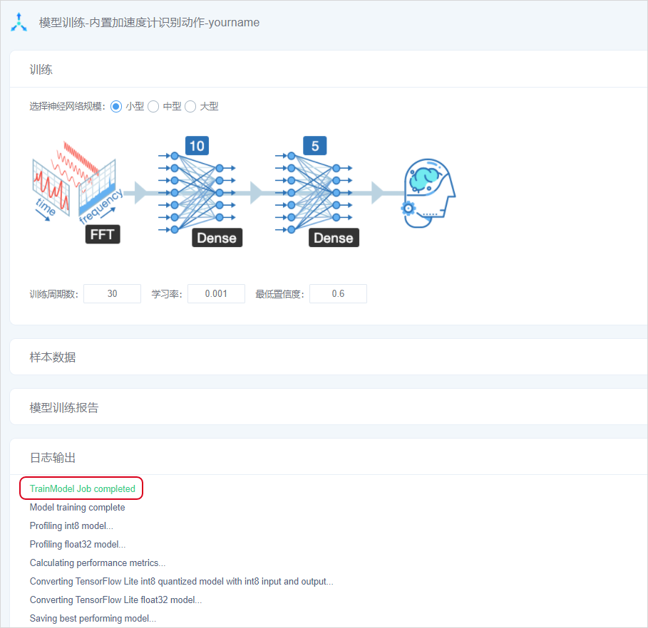

#### 3.3 观察模型性能，选择理想模型

在“模型训练报告”窗口中，您可以观察训练结果，包括模型的准确率、损失和性能。

如果训练结果不理想，您随时可以回到第一步训练模型，选择另一个大小的神经网络，调整参数训练等，直到得到一个结果满意的模型。

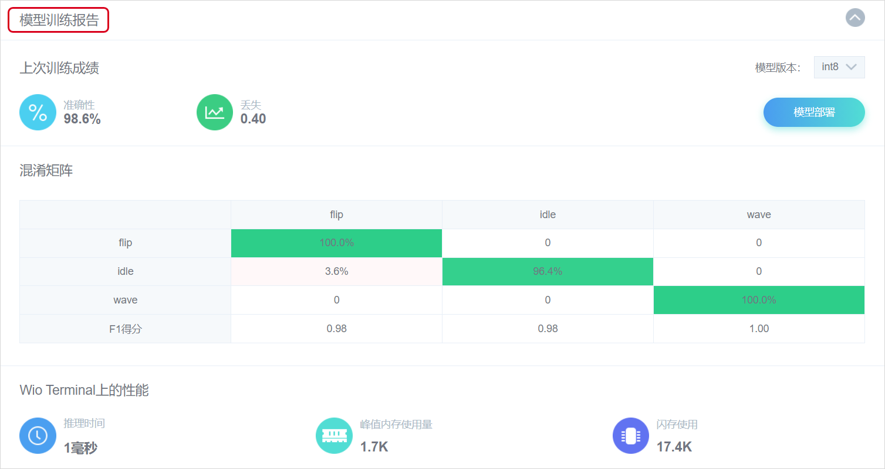

#### 3.4 部署理想模型

在“模型训练报告”窗口中，点击“模型部署”。

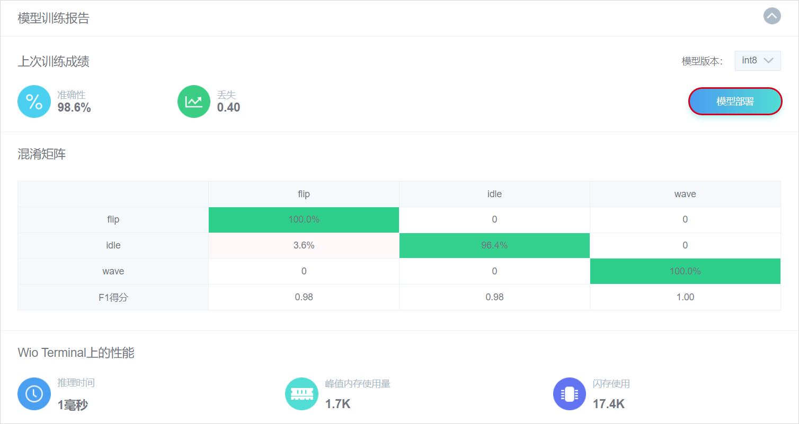

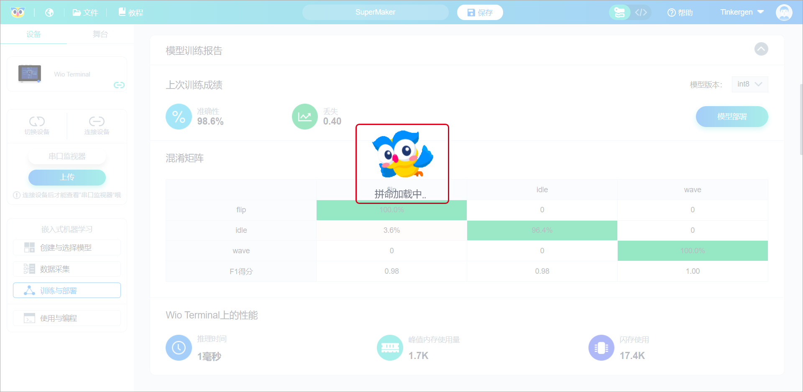

等到部署完成后，点击“确认”即可跳转到“使用与编程”窗口

### 步骤 4. 使用与编程

#### 4.1 编写使用模型的程序

在“使用与编程”界面，点击“模型使用”以调用部署的模型。

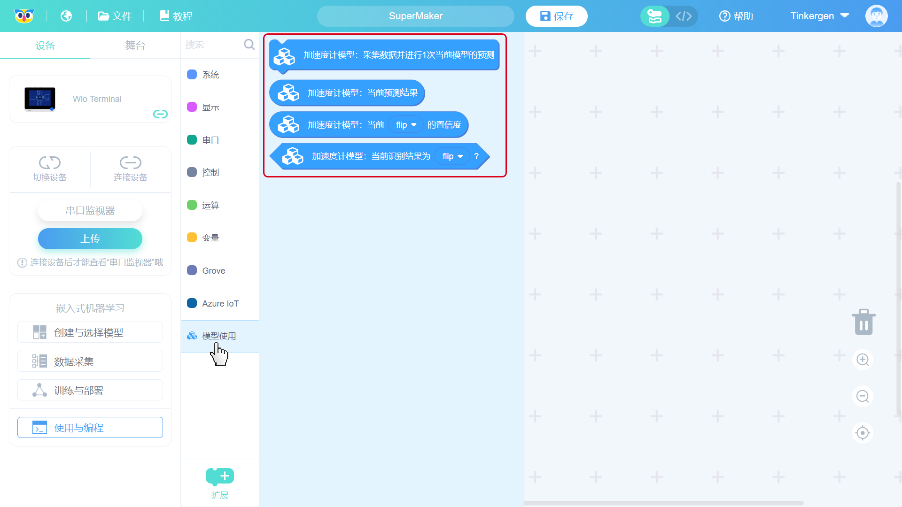

您可以尝试通过编写以下程序来调用您的模型。

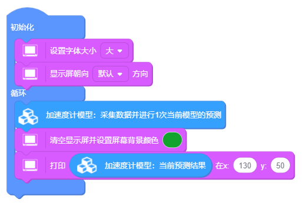

#### 4.2 将程序上传到 Wio Terminal

单击“上传”按钮。

选择与当前 Wio Terminal 对应的串口（不一定如图所示的 COM14），点击“确定”按钮。

第一次上传时间通常比较长，并且随着模型的复杂性时间会进一步增加。较小型号的上传时间约为 4 分钟，较大型号可能会消耗更长时间，这取决于您机器的性能。

#### 4.3 Wio Terminal 测试模型

翻转您的 Wio Terminal，查看其屏幕是否显示“翻转”。可以再尝试其他的动作，看看 Wio Terminal 是否识别您的动作。

**恭喜！您已经完成了第一个嵌入式机器学习模型。相信你一定有兴趣了解自己做的每一个操作的意义，那么让我们首先来学习机器学习的基础理论知识，先看看我们的输入（input）。**

## 机器学习理论（输入，标签，数据集）

输入（input）：

- 标签
- 数据集
  - 训练集、验证集和测试集
  - 数据量
  - 获取数据的方式
  - 数据集的质量

 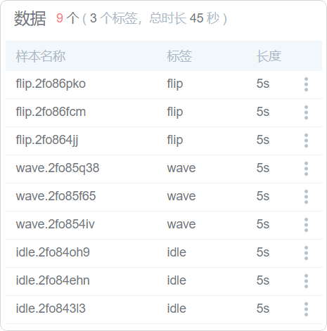

### 输入

#### 1. 标签

**1.1 什么是标签：**

顾名思义，当您为数据添加有意义的标签或为您收集的原始数据分配类别时，数据将会被标记，这意味着您向数据设置了其对应目标， AI 会通过这些数据标签来学习。

现在，让我们看看这是如何做的。假设我们有一组标有“柠檬”、“橙子”或“香蕉”的水果，模型会通过这些标记的水果进行分类训练，当训练结束后，如果这时输入有新的水果且没有贴标签，则会被模型判断并贴上标签并归入这三组中的其中一组，注意输入元素有可能同时属于多个类别。

#### 2. 数据集

**2.1 什么是数据集：**

如果您想要一个可运行且可靠的模型，则需要大量相关的高质量数据。这意味着您必须通过提供数万个示例来训练您的 ML 模型，并且让它记住您的数据片段之间的相关性。

完整数据集由训练集和测试集组成：

您提供给模型的数据称为训练数据集，而您提供给模型进行预测的数据则称为测试集。

此外，训练集可以分为两组。我们可以在开始训练后观察日志，发现训练数据集会被拆分为训练集和验证集。

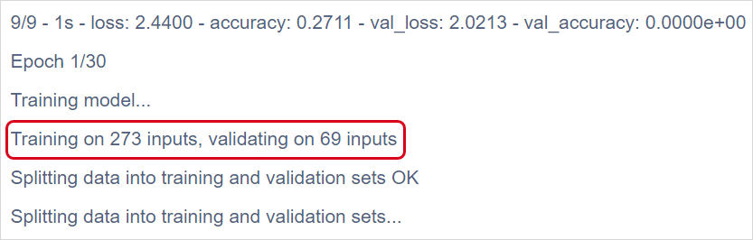

这里的 Training inputs 即为 训练集，而 validating inputs 为验证集。

- **训练集：**训练集是模型用来学习的数据。
- **验证集：**使用训练集进行训练后，使用验证集中的点来计算分类器的准确率或误差。这里的关键是我们知道验证集中每个点的真实标签，但我们暂时假装不知道，也就是我们假装将验证集中的点以没有标签的形式输入到模型分类器，然后我们会收到该点的分类和标签。完成后我们可以查看验证点的真实标签是否与收到的标签一致，看看我们是否做对了。如果我们对验证集中的每个点都这样做，我们就可以计算验证错误！

**2.2 那多少训练数据才能够呢**

如果要一个简短的回答是，这没有准确的答案。如果要稍微长一点的答案的话，那就是每个特定项目都需要不同的特定数量的训练数据，而知道需要多少训练数据的唯一方法就是反复试验。

这里有一些指南可以帮助您了解为什么这个问题并没有准确答案：

- 通常来说，具有更多属性和更多连接网络且更复杂的模型（如人工神经网络）将需要更多数据才能正确训练。
- 模型的应用范围，以及模型接受训练之后用来预测的现实生活的复杂性也会影响所需训练数据的多少，特别是异常和盲点。
- 随着时间的推移，您可能需要重新训练或调整您的模型，因为它预测的趋势会发生变化，从长远来看，这将需要更多数据。

训练集的数据量取决于多种因素，对经验丰富的工程师来说，他们大体上对训练模型的数据量有一定的了解，你可以去论坛，科学社区等一些地方来找到他们向他们请教从而精进学习。

**2.3 如何获取数据**

- 自己动手：将 Wio Terminal 与传感器或者其他设备一起使用。
- 开源社区：一些数据科学社区，如 Kaggle。
- 网络搜素：根据您的目标，在线搜索您想要的数据集。

**2.4 如何判断数据集的质量：**

**准确性：**准确性是指数据描述是否符合其在现实世界条件中的描述。如果您尝试教计算机识别猫，则需要将现实当中的猫标记为“猫”而不是“狗”。

**关联性：**您收集的数据也应该对您准备将其用于的模型中有用。如果它与您的目标不相关，则它对您并没有用处，应当舍弃。如果您想教电脑通过图片识别猫，则并不需要提供猫粮的照片。总的来说，为您的数据收集设定目标很重要，这样才知道要什么样的数据才是有用的。

**数据规模：**如果您尝试教计算机识别猫，则需要显示数千张大小、颜色和形状各不同的猫的图像，以使您的模型能够准确识别猫。

**平衡性：**平衡性是指训练集中的数据分类是否均衡，不平衡尤为常见：大多数分类数据集在每个类别中的实例数量并不相同，但微小的差异并不重要。

而当不平衡性足够大时，我们的模型会发生什么？

我们的模型通过学习数据并且“巧妙”地进行分类，得到的结果是预测“1 类”竟然达到 90% 的高准确度。

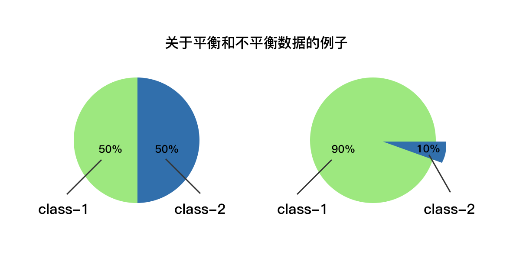

**那么如何解决失衡呢？**

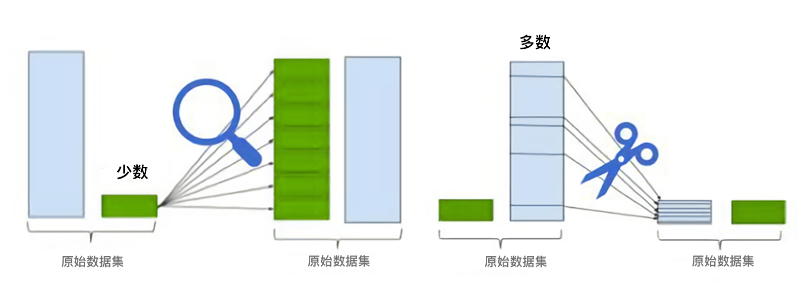

**过采样（Up Sampling）**：增加训练集中少数分类的数量。

**欠采样（Down Sampling）**：减少多数样本的数量以平衡分类分布。

## 总结

1. 背景理论知识：

- 加速度计

2. 嵌入式机器学习实践：

3. 机器学习理论（输入）

- 标签：为您收集的原始数据贴上标签以分配类别。
- 数据集：
   1. 训练集、验证集和测试集：训练集来输入模型，验证集用于验证结果以改进模型，测试集用于预测。
   1. 所需数据量：合适的规模（一般情况下越多越好）。
   1. 数据获取方式：自己获取，开源社区，互联网搜索。
   1. 数据集的质量：准确性、关联性、数据规模、平衡性。

​
