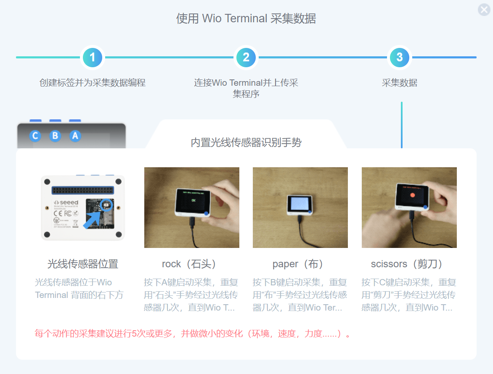
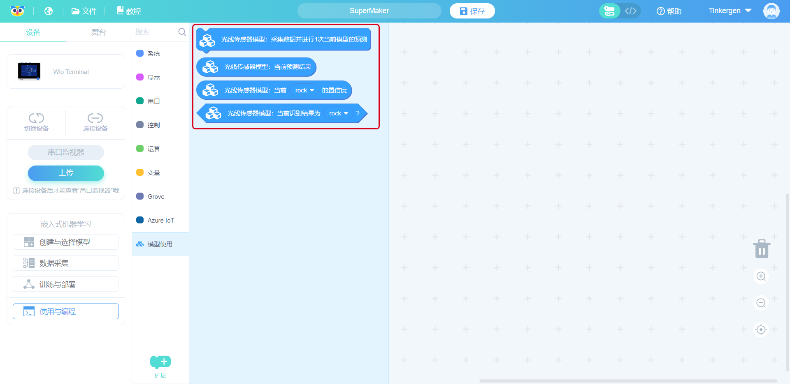

# 第3课 使用内置光线传感器进行手势识别

## 项目概述

在这节课当中我们将使用 Wio Terminal 来识别手势：利用内置光线传感器来识别石头、剪和布。

如果使用基于算法的传统编程手段，这将会非常棘手。对于传统编程的机器来说，手势必须以完全相同的方式执行才能被识别，而这在现实当中几乎不可能，其中涉及众多因素，以运动因素为例：我们手势的摆动速度、转动角度以及静置方向，严格意义上来说都不会完全相同，而这些微小变化都需要使用传统编程来制订一套规则以减少识别错误。所以如果同样使用传统编程来解决这个手势识别问题时，就需要为每种操作模式制定数百条不同的规则，但**机器学习**可以非常轻松地处理这些变化。

 一般来说，用机器学习识别手势应当是使用相机传感器。但我们使用的是光线传感器，而使用光线传感器就相当于仅仅使用相机的一个像素点来识别手势，这简直是另一个等级的挑战，那现在就让我们用这个项目挑战一下吧！

### 预期结果

如下图所示，Wio Terminal 实时显示了当前手势识别的结果： 石头、剪刀和布之一。

### 准备工作

硬件需求：Wio Terminal

连接方法：

## 背景知识

在本课中，我们将训练和部署一个简单的神经网络，对石头、剪刀、布手势进行分类，借助仅能探测到**一个像素点的光线传感器**。

这个项目的工作原理其实很简单——在光线传感器上方移动的不同手势会在特定时间段内阻挡一定量的光。 以**手势的石头**为例子，传感器一开始会是高值（传感器上方没有东西），而当手经过传感器上方时值会降低，待其完全经过后又是同样的高值。 同样的，在检测**手势的布**时，其中的每个手指都会经过一遍传感器上方，我们就可以得到“高-低-高-低-高-低-高-低-高”的值。

**石头**

**剪刀**

**布**

这些手势通过传感器时的速度和幅度的在很大差异，这些差异对于传感器探测到的数据，是应当使用机器学习模型而不是传统编程的一个很好的案例。

## 练习与实践

### 课程步骤

1. 创建与选择模型
1. 数据采集
1. 训练与部署
1. 使用与编程

### 步骤1、创建与选择模型

#### 1.1 建立“手势识别（内置光线传感器）”模块

点击“创建与选择模块”，然后点击“内置光线传感器识别手势”，如下面步骤 1 和步骤 2 所示：

给新建的模型命名：

点击“确认”就会自动跳转到数据采集界面。

### 步骤 2、 数据采集

#### 2.1 默认标签

#### 2.2 连接设备并上传 Codecraft 中的默认数据采集程序

Wio Terminal 连接后，在 Codecraft 界面，点击"上传"即可上传默认数据采集程序。

通常上传需要 10 秒钟。 程序上传后，“上传成功”的窗口将出现在如下图所示的屏幕上。

点击“我知道了”关闭上传成功弹窗，返回界面。

#### 2.3 数据采集

在右上角的超链接中，您将找到数据采集的分步介绍，请按照说明收集数据。

注意：

- Wio Terminal 按钮位置。
- 动画是已经加速过的，实际动作可能有所缓慢。
- 请注意红色提示。
- 将光标指向描述文本以获得更详细的内容。

在数据收集过程中，Wio Terminal 将会显示图标来表示当前进度，我们可以根据 Wio Terminal 显示图标来完成数据采集。

 这个信号表示正在 Wio Terminal 收集数据。

 OK表示数据收集完成。

至此，数据全部采集完成。

单击“训练与部署”。

### 步骤 3. 训练与部署

#### 3.1 设置神经网络和参数

选择你觉得合适的神经网络规模：小型、中型、大型。

接着设置参数、训练周期数（正整数）、学习率（从 0 到 1 的数字）和最小置信度（从 0 到 1 的数字）。初始页面已提供一些默认参数值。

在这里我们使用选择的规模为中，这会耗一段时间。

#### 3.2 开始训练模型

点击“开始训练”。

当您点击“开始训练”时，界面会显示“拼命加载中...”。

“拼命加载中...”的持续时间取决于所选神经网络的规模（小型、中型、大型）和训练周期数。通常来说，网络规模和训练周期数越大，所需的时间就越长。

您还可以通过观察“日志”来推断等待时间。下图中，“Epoch: 78/500”表示训练总轮数为500轮且已经训练了68轮。

#### 3.3 观察模型性能，选择理想模型

在“模型训练报告”窗口中，您可以观察训练结果，包括模型的准确率、损失和性能。

如果训练结果不理想，您随时可以回到第一步训练模型，选择另一个大小的神经网络，调整参数训练等，直到得到一个结果满意的模型。

#### 3.4 部署理想模型

在“模型训练报告”窗口中，点击“模型部署”。

等到部署完成后，点击“确认”即可跳转到“使用与编程”窗口。

### 步骤 4. 使用与编程

#### 4.1 编写使用模型的程序

在“编程”界面，点击“模型使用”以使用部署的模型。

您可以尝试通过编写以下程序来使用您的模型。

#### 4.2 将程序上传到 Wio Terminal

单击“上传”按钮。

第一次上传时间通常比较长，并且随着模型的复杂性时间会进一步增加。较小型号的上传时间约为 4 分钟，较大型号可能会消耗更长时间，这取决于您机器的性能。

#### 4.3 Wio Terminal 测试模型

做一个“剪刀”的手势或者其他手势，看 Wio Terminal 能否识别。

**恭喜！ 您已经完成了第二个嵌入式机器学习模型，相信您已经熟悉了输入（数据集和标签）并且对输出有了一定的了解。 较大的“准确性”分数可以表示您的模型运行良好，但这并不足以评估模型的性能。 那么现在让我们来看看输出吧，熟悉输出可以帮助你更好的理解和判断模型的性能。**

## 机器学习理论（输出，训练表现）

### 输出（训练表现）

- 准确率
- 损失函数
- 混淆矩阵
- F1 分数

#### 1. 准确率

准确率是衡量分类模型性能的一种方法，它通常用百分比表示，也就是预测值**等于真实值**的所占总预测值的比例。模型性能与整体的准确率相关联，而通常在训练阶段准确率就会不断变化。 与损失相比，准确率更容易理解。

#### 2. 损失函数

损失函数也称为成本函数或者代价函数，根据预测值**与真实值的差异程度**来确定预测的概率或不确定性。 这能让我们可以更细致地了解模型的性能。

与准确率不同，损失不是百分比。 它是训练集或验证集中每个样本出现的错误的总和。 在训练过程中经常使用损失来寻找模型的“最佳”参数值（例如神经网络中的权重）。 在训练过程中，这个最佳的参数值应当是最小的值。

*** 准确率与损失函数的关系**

大多数情况下，我们能观察到准确率会随着损失函数的减少而增加，但情况并非总是如此： 准确度和损失函数有着不同的定义，它们测量的是不同的参数，虽然它们通常看起来成反比，但这两个指标之间是没有数学关系的。

#### 3. 混淆矩阵

- 混淆矩阵可以展示出一个学习算法的性能。
- 它是由一个简单的方阵组成，各个方阵为：
  - 真正例（True Positive）
  - 真反例（True Negative）
  - 伪正例（False Postive）
  - 伪反例（False Negative）

​

#### 4. F1 分数

 F1 分数是衡量模型在数据集上的准确性的指标，它与准确率和召回率有关。首先我们先认识一下准确率和召回率：

而 F1 分数与准确率和召回率相关的计算公式为：

理想情况下，准确率和召回率都为1，因此 F1 为 1 ——这可以表示机器学习算法非常完美，可以使机器模型完美分类，而一般来说 F1 分数是介于 0 和 1 之间的。

## 总结

1. 背景理论知识：

- 光线传感器

2. 嵌入式机器学习实践

2. 机器学习理论（输出/训练表现）

- 准确度：一种衡量模型性能的方法。
- 损失：损失函数，也称为成本函数，根据预测与真实值的差异程度来判断预测的概率或不确定性。
- 混淆矩阵：展示学习算法性能的矩阵。
- F1 分数：

