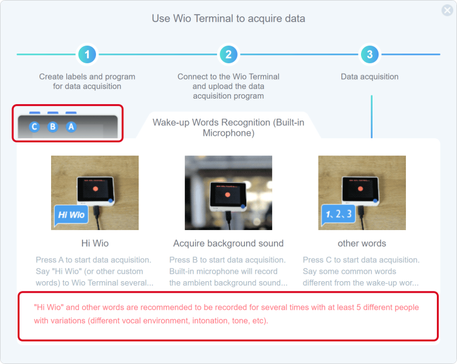
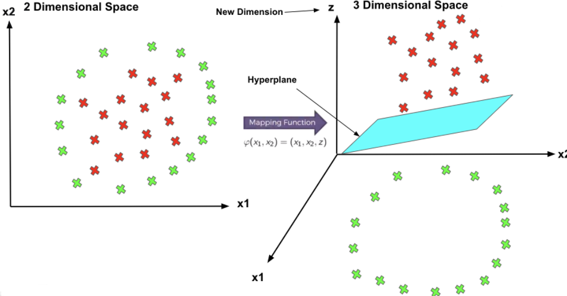

# Lesson 04 Wake-up Words Recognition by using built-in microphone

## Project Overview

You might be familiar with "Hi Siri", but how does the phone listens to our voice and gives us feedback? In this lesson, we will try to make our own "Hi Wio".

This model uses  Wio Terminal built-in microphone to collect vocal wake words and ambient sounds to train the model. This microphone also helps to wake up the device with the wake-up word ("Hi Wio").
Audio scene classification is a task where machine learning model needs to predict a class for audio segment. After this lesson, we will be able to build models to classify other kinds of audio, for example, "a crying baby", "a cough", "a dog barking", etc.

### Expected results

The desired effect is as follows: when "Hi Wio" is shouted at the Wio Terminal, the Wio Terminal could respond to you in real-time.

### Material Preparation

To achieve the above results, we need:
Hardware requirements: Wio Terminal
Connection method:

## Theory

Let's learn more about sound processing in computers.
Sound is a vibration that propagates (or travels) as an acoustic wave through a transmission medium such as a gas, liquid or solid.

The source of sound pushes the surrounding medium molecules, they push the molecules next to them, and so on. Upon reaching other objects, they vibrate slightly. We use this principle in microphones.  The microphone membrane is pushed inward by the medium molecules and then goes back to its original position.

That generates an alternating current in the circuit, where voltage is proportional to the amplitude of the sound. Louder is the sound, more it pushes the membrane thus generating higher voltages at the output. We then read this voltage with an analog-to-digital converter and record at equal intervals.

We can not do much with this raw sound representation but we can cut and paste it into several parts or make it quieter or louder. In order to analyze the sound, it is, well, too raw.

Normal raw data contains a lot of information. Studies have shown that humans do not perceive frequencies on a linear scale. Humans are better at detecting differences in lower frequencies than higher frequencies. For example, we can easily tell the difference between 500 and 1000 Hz but we will hardly be able to tell a difference between 10000 and 10500 Hz. Even though the distance between the two pairs are the same.

In  1937, Stevens Volkmann and Newmann proposed a unit of pitch such that equal distances in pitch sound equally distant to the listener. This is called the mel scale.

Mel Frequency Cepstral Co-efficients (MFCC) is an internal audio representation format which is easy to work with. This is similar to JPG format for images.

 

It is time to finally start with practical implementation.

## Practice

### Project Steps

1. Creating and Selecting Models
1. Data Acquisition
1. Training and Deployment
1. Programming

### Step 1. Create and select models

#### 1.1 Create a " Wake-up Words Recognition(Built-in Microphone)" model

Click on "Create and select model", click on " Wake-up Words Recognition(Built-in Microphone)", as shown in steps 1 and 2 below.

Enter a NAME according to the requirements.

Click Ok and it will automatically jump to the Data Acquisition interface.

### Step 2. Acquisition of data

#### 2.1 Default label

#### 2.2 Connect the device and upload the default data acquisition program in Codecraft

When the Wio Terminal is connected,  click in the Codecraft window. This action will upload the default data acquisition programme.

Usually, it takes 10 seconds to upload.  Once the program is uploaded, the "Upload Successful"  window will appear on the screen shown below. This is shown in the image below.

Click "Roger" to close the upload success pop-up window above and return to the programming screen.

#### 2.3 Acquisition of data

In the upper right hyperlink, you will find a step-by-step introduction to data acquisition. Follow the instructions to collect data.

 **Attention:**

- Say words without interruption when recording with the labels "Hi Wio" and "other words" to ensure that the audio is as more different as possible as compared to other labels "background sound".
- Wio Terminal button location.
- Animated GIF has been accelerated, the actual action can slightly slow down.
- Notice the red tips.
- Point the curser over Description Texts for more detailed content.

Start and finish data acquisition according to the Wio Terminal display.

 This signal means data is being collected.

 OK means the collection is complete.
​
Now, the data acquisition is finished.

Click on "Training & Deployment".

### Step 3. Training and deployment

#### 3.1 Set neural network and parameters

Select the suitable neural network size: one of small, medium and large
Set parameters, number of training cycles (positive integer), learning rate (number from 0 to 1) and minimum confidence rating(number from 0 to 1).
The interface provides default parameter values.
In this case, we are using MEDIUM. It will take quite a long time.

#### 3.2 Start training the model

Click "Start training".

When you click "Start training", the interface displays "Loading...".

​
The duration of "Loading.." varies depending on the size of the selected neural network (small, medium and large) and the number of training cycles. The larger is the network size and number of training cycles, the longer it takes.

You can also infer the waiting time by observing the "Log". In the figure below, "Epoch: 7/50"  indicates the total number of training rounds is 50 while 7 rounds have been trained.

#### 3.3 Observe the model performance to select the ideal model

In the "Model Training Report" window, you can observe training results including the accuracy, loss and performance of the model.
If the training results are not satisfactory, you can go back to the first step of training the model, select another size of the neural network or adjust the parameters and train it until you get a model with satisfactory results.

#### 3.4 Deploy the ideal model

In the "Model Training Report"  window, click 

Once the deployment is complete, click "Ok" to jump to the "Programming" window.

### Step 4. Use and programming

#### 4.1 Write the program for using the model

In the "Programming" interface, click on "Use Model" to use the deployed model.

Try to use your model by writing the following program.

#### 4.2 Upload the program to Wio Terminal

Click the "Upload" button.

The first upload time is usually long and it increases with the complexity of the model. The upload time for smaller models is about 4 minutes or longer(depending on the performance of your machine).

#### 4.3 Wio Terminal test model

Try to say "Hi Wio" to your Wio Terminal to see whether it has been waked up.

**Congratulations! You have completed your third TinyML model. I believe you have tried different scale models so as to get a better model performance. Let's take a look inside the model and deeply understand the "differences".**

## ML Theory(know the different scale models)

- Artificial Neural Network Architecture
   1. Nodes
   1. Layer
   1. ANN
- different scale Neural Network
   1. Size
   1. Width
   1. Depth
   1. Capacity
   1. Architecture

### 1. Artificial Neural Network Architecture (ANN)

#### 1.1 What is Nodes

Neuron nodes are processing units of the network. Each neuron weighs and sums the different inputs and passes them through an activation function. The role of the activation function is to buffer the data before it is fed to the next layer. You can change the activity of your neuron.
Neuron nodes are processing units of the network, which were inspired by neurons in the human brain. Neurons in deep learning models are nodes through which data and computations flow, so as to build computer algorithms that behave similarly to neurons in the brain.

#### 1.2 What is Layer

In deep learning models, layer is a structure or network topology in the architecture of the model which takes information from the previous layers and then passes information to the next layer.

#### 1.3 What is ANN?

ANN is made of three layers namely input layer, output layer and hidden layer/s. There must be a connection from the nodes of the input layer with the nodes of the hidden layer and from each hidden layer node with the nodes of the output layer.  

We can summarize the types of layers as follows:

- **Input Layer**: Input variables, sometimes called the visible layer. The input layer takes data from the network.
- **Hidden Layers**: Layers of nodes between the input and output layers. There may be one or more of these layers. The hidden layer receives the raw information from the input layer and processes them. The obtained value is transferred to the output layer.
- **Output Layer**: A layer of nodes that produces the output variables.

### 2. Different scales of Neural Network

#### 2.1 Size: The number of nodes in the model

#### 2.2 Width: The number of nodes in a specific layer

The following Image tells us the "**Width**" plays a significant role in a model.

#### 2.3 Depth: The number of layers in a neural network

##### 2.3.1 Why to Have Multiple Layers?

A single-layer neural network can only be used to represent linearly separable functions. It means two classes in a classification problem can be neatly separated by a line.

If your problem is relatively simple, perhaps a single-layer network would be sufficient.

Most problems that we are interested in are not linearly separable.

A Multilayer Perceptron can be used to represent convex regions. It means that they can learn to draw shapes around examples in some high-dimensional space that can separate and classify them by overcoming the limitation of linear separability.

(In fact, there is a theoretical finding by Lippmann in a paper published on 1987, "An introduction to computing with neural nets" that shows that an MLP with two hidden layers is sufficient for creating classification regions of any desired shape. This is instructive, although it should be noted that there is no indication of how many nodes to use in each layer or how to learn the weights is given.

A further theoretical finding and proof have shown that MLPs are universal approximators. It means using one hidden layer, an MLP can approximate any function that we require.)

#### 2.4 Capacity

The type or structure of a function that can be learned by a network configuration. Sometimes called “_representational capacity_“.

#### 2.5 Architecture

The specific arrangement of the layers and nodes in the network. The different types of layers are:  Reshape layer, Flatten layer, Dropout layer, Conv2D/pool layer, Conv1D/pool layer, Dense layers, etc.

##### 2.5.1 Why to Have Different Types Of Layers?

Different layers perform different transformations on their inputs. Some layers are better suited for specific tasks than others.
For example, a convolutional layer is usually used in models that deal with image data while Recurrent layers are used in models that work with time-series data. Fully connected layers connect each input to each output within its layer.

details of layers are mentioned in Lesson 8.

In conclusion, SMALL ,MEDIUM, and BIG models have different numbers of the hidden layer, types of layers, and nums of neurons.

## Summarization

1. Theroy:

- Microphone

2. TinyML practice

3. ML theory (Model scale)

- Artificial Neural Network Architecture
   1. Nodes: Neuron nodes are processing units of the network.
   1. Layer: In deep learning models,  layer is a structure or network topology in the architecture of the model which takes information from the previous layers and then passes information to the next layer.
   1. ANN: ANN is made of three layers namely input layer, output layer and hidden layer/s.
- Different scale Neural Network
   1. Size: The number of nodes in the model.
   1. Width: The number of nodes in a specific layer.
   1. Depth: The number of layers in a neural network.
   1. Capacity: The type or structure of a function that can be learned by a network configuration.
   1. Architecture: The specific arrangement of the layers and nodes in the network.
