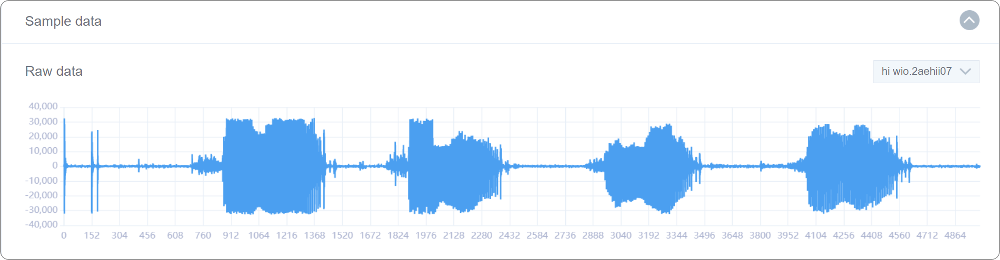

# 第4课 使用内置麦克风识别唤醒词

## 项目概述

我们对于 iPhone 的“Hi, Siri”可能很熟悉，但其中的原理，手机是如何听取声音并实现反馈我们是否了解呢？在本课中，我们将试着用机器学习模型制作自己的“Siri”——“Wio”，并用“Hi, Wio”进行将其进行唤起。

我们将使用 Wio Terminal 内置麦克风来收集唤醒单词的语音以及说话环境的声音来训练模型。在本课结束后，不仅仅只是唤醒单词的语音识别，我们甚至可以建立机器学习模型来对其他类型的音频进行分类，例如“哭泣的婴儿”，“咳嗽”，“狗吠叫”等。

### 预期结果

当 Wio Terminal 内置麦克风检测到“Hi, Wio”的声音时，Wio Terminal 可以做到实时响应。

### 准备工作

硬件需求：Wio Terminal

连接方法：

## 背景知识

让我们更多地了解计算机如何处理声音：

首先，声音是一种震动，以声波的形式通过传输介质传播，介质包括气体，液体和固体。

因为声音是一种震动，在声源处它会推动周围的介质分子，周围的介质分子又会推动它周围的介质分子，依此类推，到达其他分子后，它们都会略微振动。

我们在麦克风中使用的就是这个原理，麦克风膜会被介质分子向内推动而又回到原始位置，这期间会在电路中产生电压，其中电压与声音的幅度成正比。声音越响亮，推动膜的次数越多，输出端产生的电压就越高。

最后，我们用模/数转换器来读取这个电压，并以相等的间隔进行记录。

可是我们无法对这种原始记录的声音做太多事情，因为其包含了除我们想要的声音外，还有许多需要剔除的杂音，我们可以将其剪切成好几个部分使其更安静或更响亮以供机器能分辨。那么如何分辨呢？

研究表明，人类更擅长检测较低频率之间的差异而不是较高频率之间的。例如，我们可以很容易地分辨出 500 Hz 和 1000 Hz 之间的差异，但我们几乎无法分辨出 10000 Hz 和 10500 Hz 之间的差异。即使这两对声音频率之间的距离相同。

1937年，史蒂文斯-沃尔克曼（Stevens-Volkmann）和纽曼（Newmann）提出了一个音高单位，使得声音的间距的音高单位能与听众的距离相等。这被称为 Mel 频谱图，同时他们提出梅尔倒谱系数特征（Mel Frequency Cepstral Co-efficients）。

    

梅尔倒谱系数特征（MFCC）是一种易于使用的内部音频表示格式，这类似于图像的JPG格式——那么我们就可以像处理图像一样来处理音频并教机器去如何分辨。

了解原理后，现在是时候开始实施我们的项目了。

## 练习与实践

### 课程步骤

1. 创建与选择模型
1. 数据采集
1. 训练与部署
1. 使用与编程

### 步骤1、创建与选择模型

#### 1.1 建立“唤醒词识别（内置麦克风）”模块

点击“创建与选择模型”，然后点击“内置麦克风识别唤醒词”，如下面步骤 1 和步骤 2 所示：

给新建的模型命名。

点击“确认”就会自动跳转到数据采集界面。

### 步骤 2、 数据采集

#### 2.1 默认标签

#### 2.2 连接设备并上传 Codecraft 中的默认数据采集程序

Wio Terminal 连接后，在 Codecraft 界面，点击"上传"即可上传默认数据采集程序。

通常上传需要 10 秒钟。 程序上传后，“上传成功”的窗口将出现在如下图所示的屏幕上。

点击“我知道了”关闭上传成功弹窗，返回界面。

#### 2.3 数据采集

在右上角的超链接中，您将找到数据采集的分步介绍。请按照说明收集数据。

注意：

- Wio Terminal 按钮位置。
- 动画是已经加速过的，实际动作可能有所缓慢。
- 请注意红色提示。
- 将光标指向描述文本以获得更详细的内容。

在数据收集过程中，Wio Terminal 将会显示图标来表示当前进度，我们可以根据 Wio Terminal 显示图标来完成数据采集。

 这个信号表示正在 Wio Terminal 收集数据。

 OK表示数据收集完成。

至此，数据全部采集完成。

单击“训练与部署”。

### 步骤 3. 训练与部署

#### 3.1 设置神经网络和参数

选择你觉得合适的神经网络规模：小型、中型、大型。

接着设置参数、训练周期数（正整数）、学习率（从 0 到 1 的数字）和最小置信度（从 0 到 1 的数字）。初始页面已提供一些默认参数值。

在这里我们使用选择的规模为中，这会耗一段时间。

#### 3.2 开始训练模型

点击“开始训练”。

当您点击“开始训练”时，界面会显示“拼命加载中...”。

“拼命加载中...”的持续时间取决于所选神经网络的规模（小型、中型、大型）和训练周期数。通常来说，网络规模和训练周期数越大，所需的时间就越长。

您还可以通过观察“日志”来推断等待时间。下图中，“Epoch: 10/50”表示训练总轮数为 50 轮且已经训练了 10 轮。

#### 3.3 观察模型性能，选择理想模型

在“模型训练报告”窗口中，您可以观察训练结果，包括模型的准确率、损失和性能。

如果训练结果不理想，您随时可以回到第一步训练模型，选择另一个大小的神经网络，调整参数训练等，直到得到一个结果满意的模型。

#### 3.4 部署理想模型

在“模型训练报告”窗口中，点击“模型部署”。

等到部署完成后，点击“确认”即可跳转到“使用与编程”窗口。

### 步骤 4. 使用与编程

#### 4.1 编写使用模型的程序

在“使用与编程”界面，点击“模型使用”以使用部署的模型。

您可以尝试通过编写以下程序来使用您的模型。

#### 4.2 将程序上传到 Wio Terminal

单击“上传”按钮。

第一次上传时间通常比较长，并且随着模型的复杂性时间会进一步增加。较小型号的上传时间约为 4 分钟，较大型号可能会消耗更长时间，这取决于您机器的性能。

#### 4.3 Wio Terminal 测试模型

尝试喊一下“Hi, Wio”，看能否唤醒机器。 

**祝贺您完成了第三个 TinyML 模型！相信您已经尝试了不同比例的模型，以便获得更好的模型性能。现在让我们对模型内部进行深究，深刻理解“差异”。**

## 机器学习理论（不同的比例模型）

- 人工神经网络结构
   1. 节点
   1. 层
   1. 人工神经网络结构（ANN）
- 不同尺度神经网络
   1. 规模大小
   1. 神经网络宽度
   1. 神经网络深度
   1. 模型容量
   1. 模型架构

### 1.人工神经网络结构（ANN）

**1.1什么是节点**

神经元节点是网络的处理数据的单元。每个神经元对不同的输入进行加权和求和，并通过激活函数传递它们，激活函数的作用是在数据送到下一层之前可对其进行缓冲。

**1.2什么是层（layer）**

 在深度学习模型中，层是模型的体系中的一种结构或者网络拓扑，它从上一层获取信息，然后将信息传递到下一层。我们可以认为一层是由一个一个节点构成。

**1.3 人工神经网络结构（ANN）是什么？**

   人工神经网络由输入层、输出层和隐藏层三层组成。层的各个类型总结如下：

- **输入层**：输入层用来输入变量，有时称为可见层。
- **输出层**：产生输出变量的节点层。
- **隐藏层**：输入层和输出层之间的节点层。这些层中可能有一个也可能有多个。隐藏层从输入层接收输入的信息并进行处理，得到的值就被传输到输出层。

每个输入层的节点与隐藏层的节点，每个隐藏层节点与输出层的节点之间，一定会存在连接。

#### 2.不同规格的神经网络

**2.1 规模大小：整个模型中的节点数**

**2.2 神经网络宽度：在特定层中的节点数**

下图告诉我们“**宽度**”在模型中起着重要作用。

**2.3 神经网络深度：神经网络中的层数**

**2.3.1 为什么要有多个层？**

 单层神经网络只能用来表示线性可分函数。这意味着一个分类问题中的两个类就只用一条线分开。

当然如果您的问题相对简单，也许单层神经网络就足够了，但很显然我们感兴趣的大多数问题都不是线性可分的，对于很多问题，我们可以使用多层感知器（Multilayer Perceptron）。

多层感知器（MLP）可以用来表示凸区域。这意味着他们可以学习在一些高维空间中围绕输入的数据来绘制形状，正如上图所示。它通过克服线性可分性的限制，利用这些绘制空间对输入的数据进行分离和分类。

*事实上，利普曼在1987年发表的论文《神经网络计算导论》中，有一个理论表明具有两个隐藏层的 MLP 足以创建任何所需形状的分类区域。尽管应该注意的是，这里并没有指示每个层中要使用多少节点或如何学习权重，但毋庸置疑这是有指导意义的。进一步的理论发现和证明表明，MLP是通用的近似器。这意味着每使用一个隐藏层，MLP 都可以近似我们需要的任何函数。

**2.4 模型容量：**

可通过网络配置学习的功能类型或结构，有时被称为“表示容量（representational capacity）”。

**2.5 模型架构：**

网络中各层和节点的具体排列。不同类型的层还有：Reshape 层, Flatten 层, Dropout 层, Conv2D/pool 层, Conv1D/pool 层, Dense 层等等。

***为什么要有不同类型的层？**

不同的层对其输入执行的转换是不同的，某些层比其他层更适合于某些特定任务。

 例如，卷积层通常用于处理图像数据的模型，而递归层用于处理时间序列数据的模型。完全连接的层将其层内的每个输入连接到每个输出。

**（第8课中会有更多关于层的细节。）**

总之，小型、中型和大型模型都是有不同数量的隐藏层和神经元，还有许多不同类型的层。

## 总结

1. 背景知识

- 麦克风

2. 嵌入式机器学习实践

3. ML 理论（模型规模）

- 人工神经网络结构
   1. 节点：神经元节点是网络的处理单元。
   1. 层：在深度学习模型中，层是模型架构中的一种结构或网络拓扑，它从上一层获取信息，然后将信息传递到下一层。
   1. 人工神经网络（ANN）：ANN 由三层组成，即输入层、输出层和隐藏层。
- 不同尺度神经网络
   1. 大小：模型中的节点数。
   1. 宽度：特定层中的节点数。
   1. 深度：神经网络中的层数。
   1. 容量：可通过网络配置学习的功能类型或结构。
   1. 架构：网络中各层和节点的具体安排。
