# Lesson 05 Smell recognition by using Grove-Multichannel Gas Sensor

## Project Overview

In this project, we are going to make an AI powered artificial nose that can sort alcohol from cola or identify whatever else you train it to smell. We use the Wio Terminal external Grove - Multichannel Gas Sensor v2 to collect different odor data and train the model to differentiate between cola, alcohol and air.

This is a project inspired by [Benjamin Cabé's Artificial nose project](https://twitter.com/kartben/status/1258791793073815552). "I spent quite some time trying to perfect my bread recipe, including trying to determine when my sourdough starter would be in the ideal condition to bake perfect baguettes." Cabe said. "Fast-forward to a few weeks later, I had assembled a full-blown (pun intended) artificial nose"
So after the project, you can try to build your own project detecting other odours.

### Expected results

The desired result are shown in the Window below where the Wio Terminal displays the name of the currently detected alcohol or cola in real time.
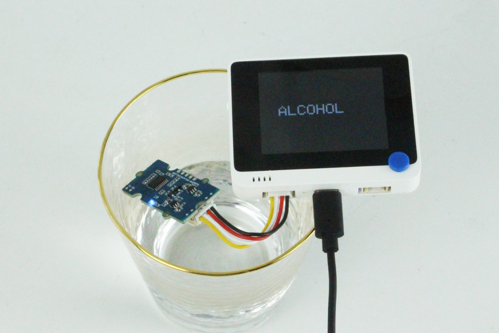 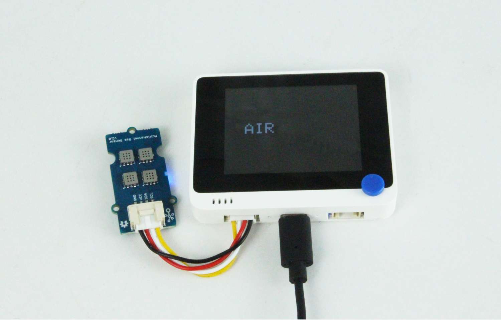 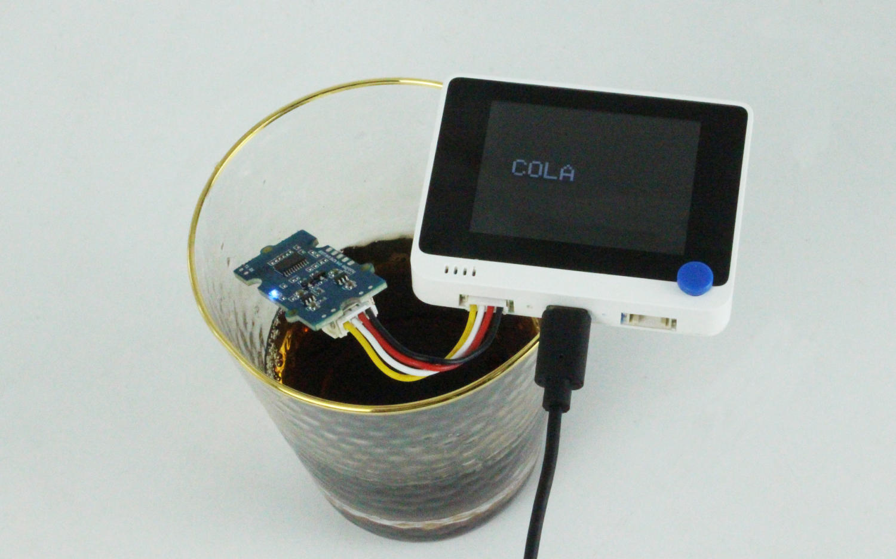

### Material Preparation

Hardware requirements:

- [Wio Terminal](https://www.seeedstudio.com/Wio-Terminal-p-4509.html)
- [Grove - Multichannel Gas Sensor v2](https://www.seeedstudio.com/Grove-Multichannel-Gas-Sensor-v2-p-4569.html)

Connection method:

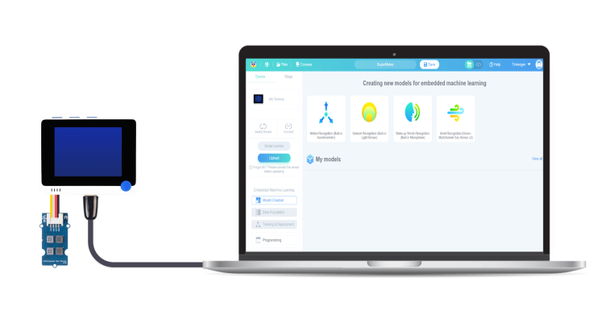

 **Note**
Before using it, the sensor needs to be preheated to achieve the internal chemical balance. The preheat voltage is consistent with its heating voltage VH. The storage time and corresponding warm-up time are recommended as follows.

#### How Does Storage Time Affect The Recommended Warm-Up Time of This Sensor?

| Storage time      | Recommended warm-up time |
| ------------------- | -------------------------- |
| Less than 1 month | No less than 24 hrs      |
| 1-6 months        | No less than 48 hrs      |
| Over 6 months     | No less than 72 hrs      |

## Theory

The gas sensor uses a MEMS process to fabricate a micro-thermal plate on a Si substrate using a metal oxide semiconductor material with low conductivity in clean air. When the sensor is exposed to a gas environment with odour of a specific gas, the conductivity of the sensor changes with the concentration of the gas being detected in the air. Higher is the concentration of gas, the Higher the conductivity of the sensor. The change in conductivity is converted to an output signal corresponding to the concentration of the gas using a simple circuit.

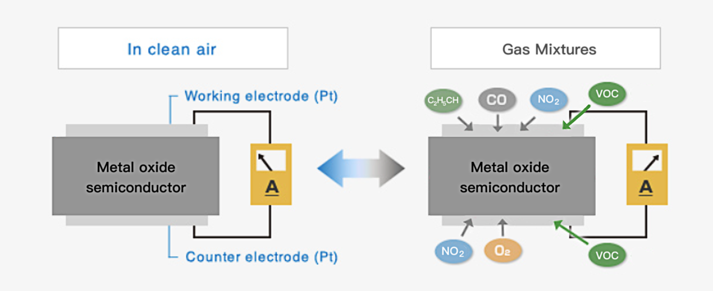

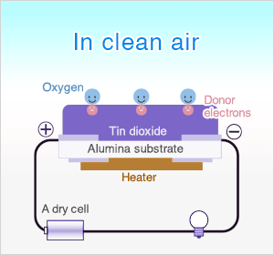

Grove - Multichannel Gas Sensor V2 has 4 measuring units, each of them is sensitive to various kinds of gases which means you are able to get four sets of data at the same time. Different sorts of gases can also be judged by these four sets of data.

It can detect a variety of gases besides Carbon monoxide (CO), Nitrogen dioxide (NO2), Ethyl alcohol(C2H5OH), Volatile Organic Compounds (VOC) etc.

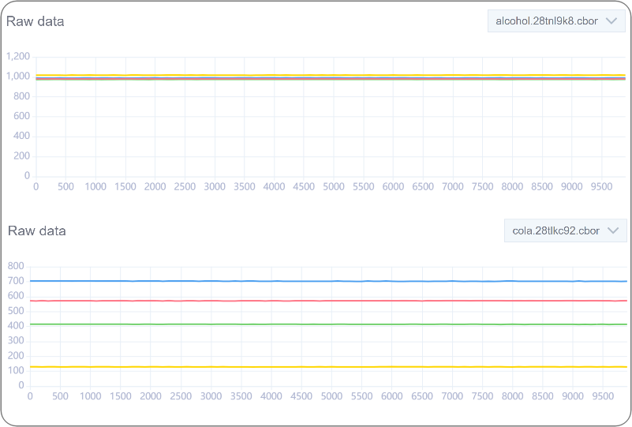

The content and combination of these four gases in a specific beverage or gas emitted by a substance is a set of values with certain characteristics. This set of characteristic values can be used to build a model to identify the gases emitted by different substances.

## Practice

### Project Steps

1. Creating and Selecting Models
2. Data Acquisition
3. Training and Deployment
4. Programming

### Step 1. Create and select models

#### 1.1 Create a " Smell Recognition (Grove - Multichannel Gas Sensor v2)" model

Click on "Create and select model", click on " Smell Recognition (Grove - Multichannel Gas Sensor v2)", as shown in steps 1 and 2 below.

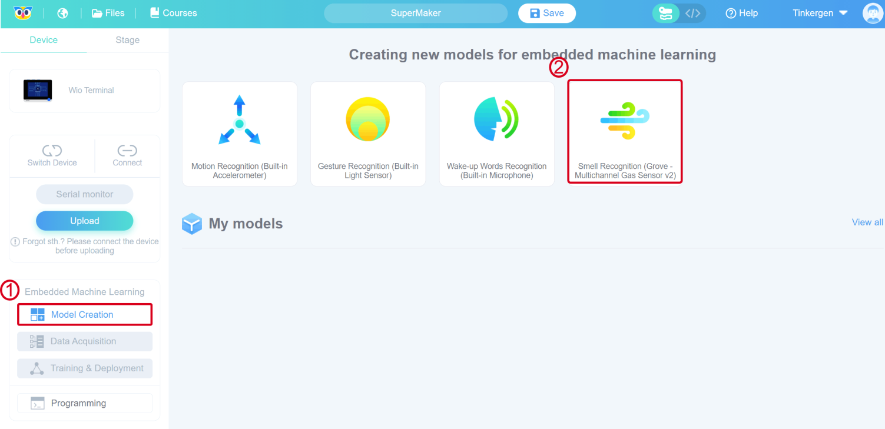

Enter a NAME according to the requirements.

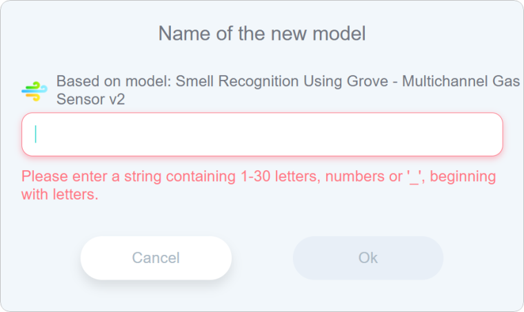

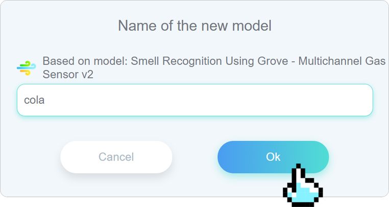

Click Ok and it will automatically jump to the Data Acquisition interface.

### Step 2. Acquisition of data

#### 2.1 Default label

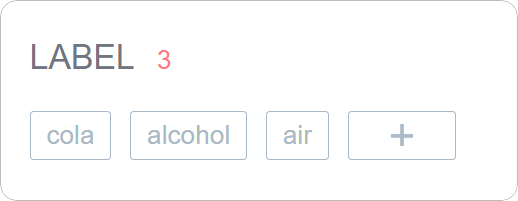

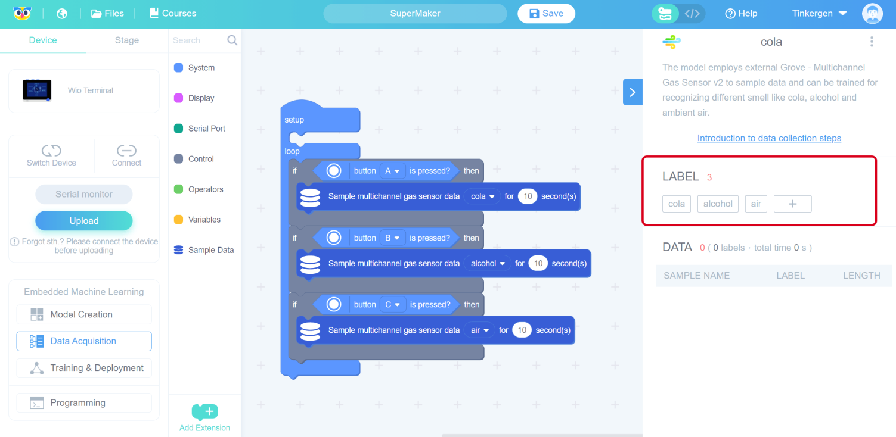

#### 2.2 Connect the device and upload the default data acquisition program in Codecraft

When the Wio Terminal is connected,  click in the Codecraft window. This action will upload the default data acquisition programme.

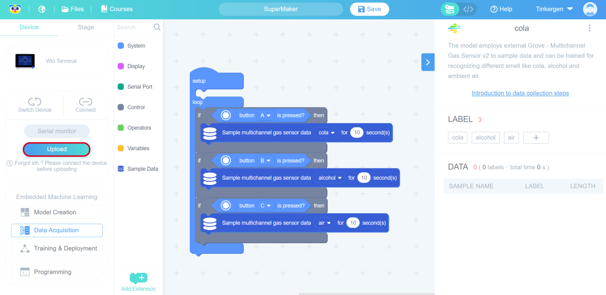

#### 2.3 Acquisition of data

In the upper right hyperlink, you will find a step-by-step introduction to data acquisition. Follow the instructions to collect data.

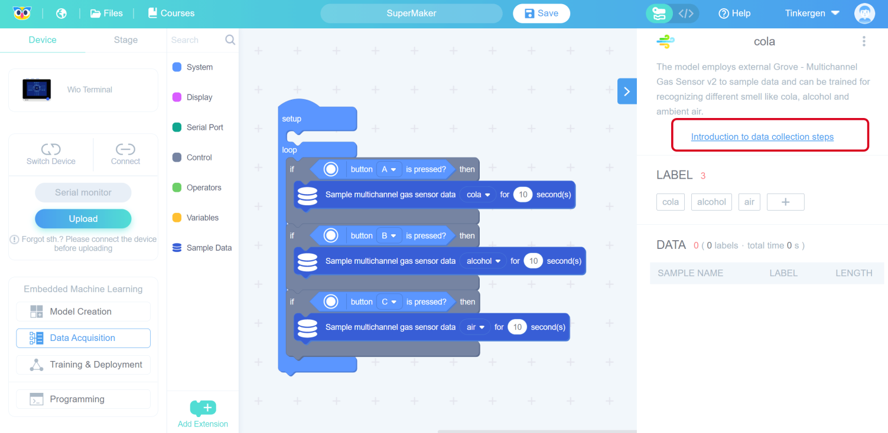

 **Attention:**

- The sensor needs to be preheated before use to achieve the internal chemical balance.
- Wio Terminal button location.
- Animated gif has been accelerated, the actual action can slightly slow down.
- Please notice the red tips.
- Point the cursor over Description Texts for more detailed content.

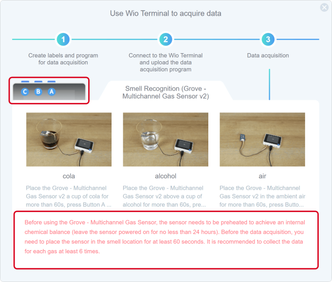

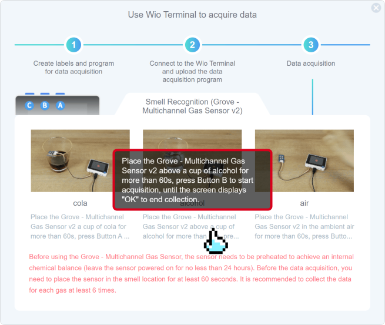

Now, the data acquisition is finished.

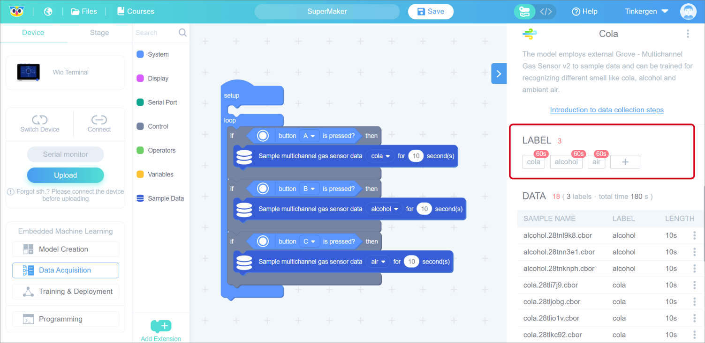

Click on "Training & Deployment"

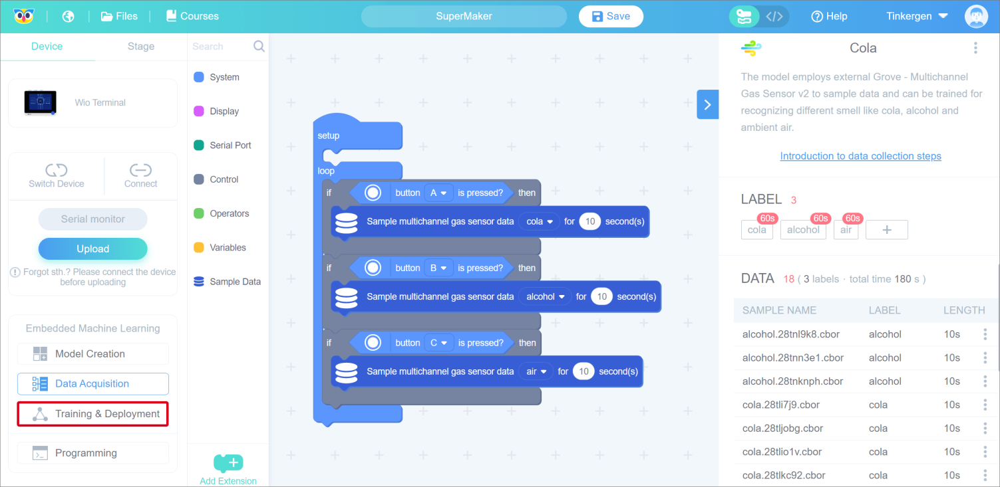

### Step 3. Training and deployment

#### 3.1 Set neural network and parameters

Select the suitable neural network size: one of small, medium and large
Set parameters, number of training cycles (positive integer), learning rate (number from 0 to 1) and minimum confidence rating(number from 0 to 1).
The interface provides default parameter values.

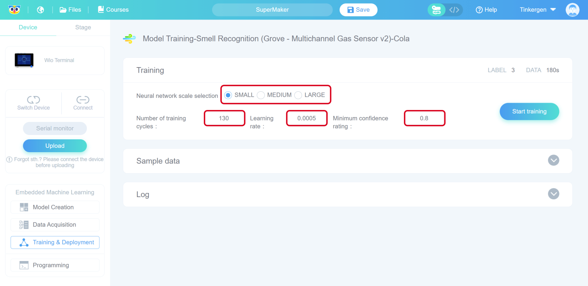

#### 3.2 Start training the model

Click "Start training"

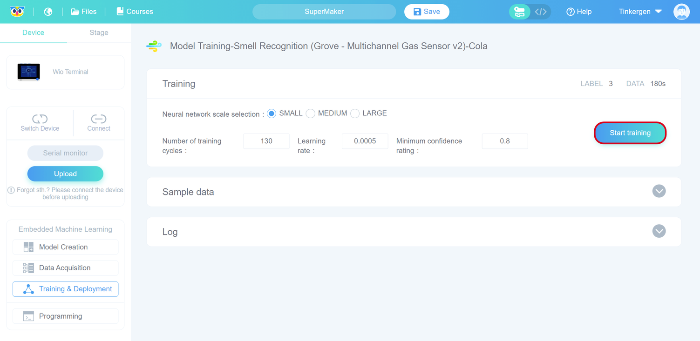

The duration of "Loading.." varies depending on the size of the selected neural network (small, medium and large) and the number of training cycles. Larger is the network size and number of training cycles, the longer it takes.

You can also infer the waiting time by observing the "Log". In the figure below, "Epoch: 7/60"  indicates the total number of training rounds is 60 while 7 rounds have been trained.

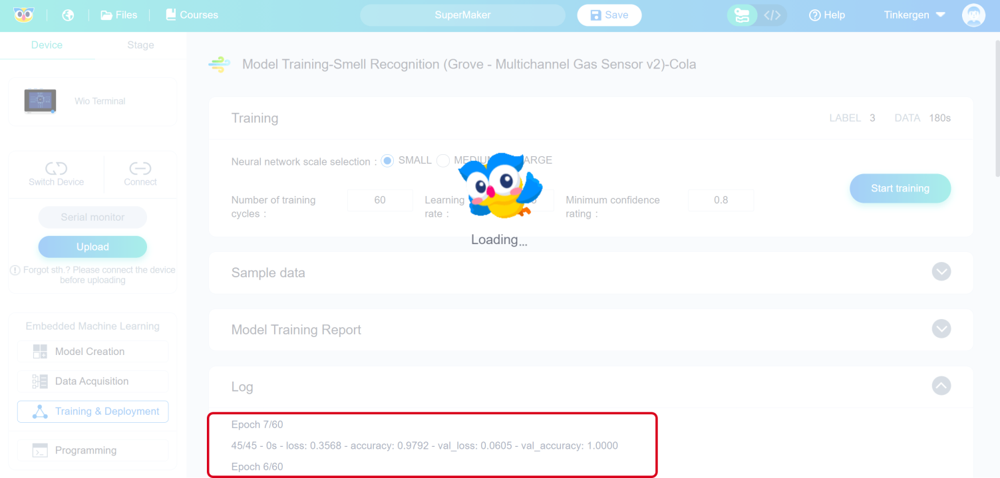

#### 3.3 Observe the model performance to select the ideal model

In the "Model Training Report" window, you can observe training results including the accuracy, loss and performance of the model.
If the training results are not satisfactory, you can go back to the first step of training the model, select another size of the neural network or adjust the parameters and train it until you get a model with satisfactory results.

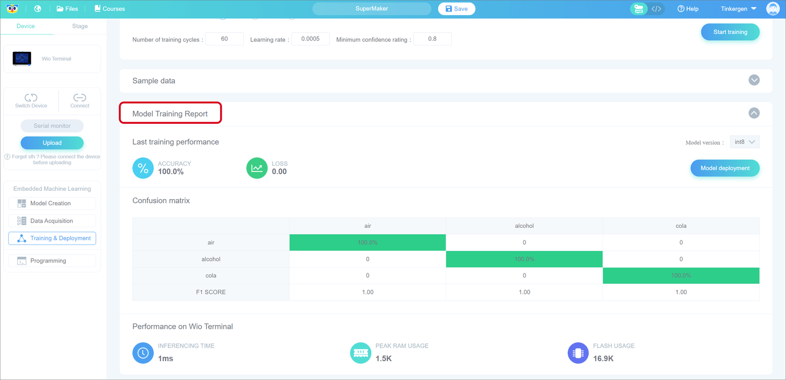

#### 3.4 Deploy the ideal model

In the "Model Training Report"  window, click .

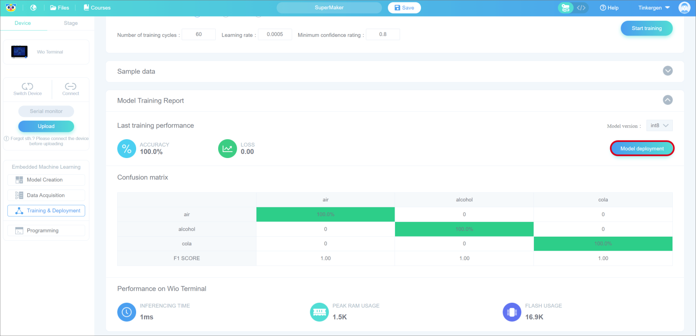

Once the deployment is complete, Click "Ok" to jump to the "Programming" screen.

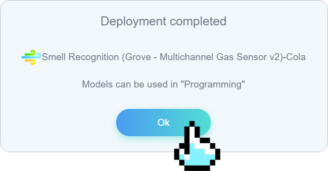

### Step 4. Use and programming

#### 4.1 Write the program for using the model

In the "Programming" window, click on "Use Model" to use the deployed model.

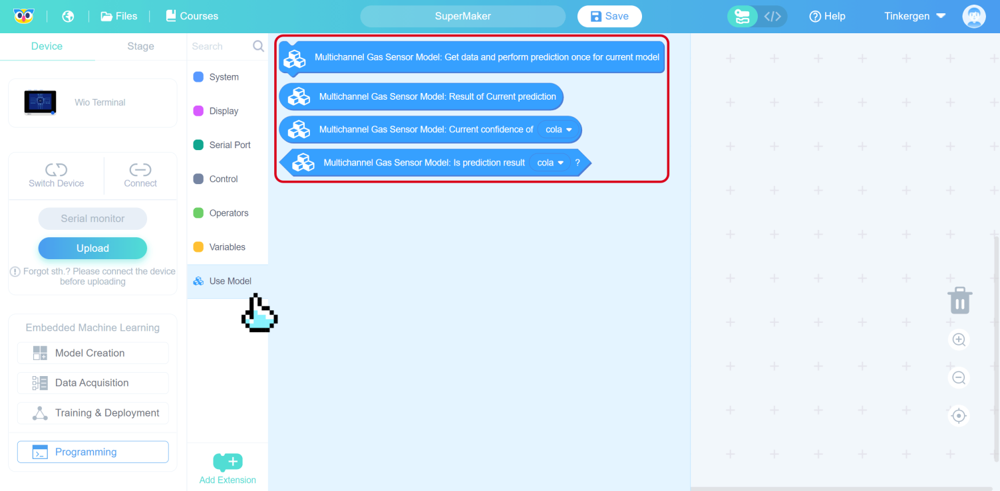

Try to use your model by writing the following programme.

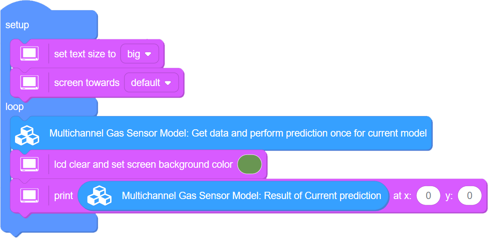

#### 4.2 Upload the program to Wio Terminal

Click the "Upload" button.

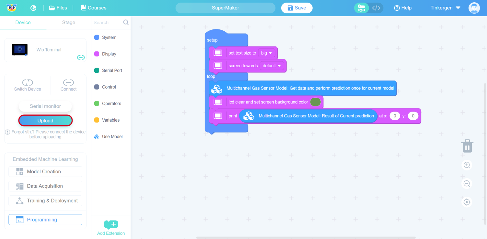

#### 4.3 Wio Terminal test model

Put your Grove - Multichannel Gas Sensor v2 near cola to see whether Wio Terminal's screen show "cola".Try other beverages, and see whether the Wio Terminal recognizes your beverages.

**Congratulations! You have completed your fourth TinyML model. I believe you have tried to set the parameters, the number of training cycles (positive integer), learning rate (0~1 number) and the minimum confidence rating(0~1 number) but how these parameters affect our model's performance?**

**Let's start learning these special parameters.**

## ML Theory(hyperparameters)

### hyperparameters

What are Hyperparameters?
Hyperparameters are:

- the variables that determine the network structure
  1. Number of Hidden Units
  2. Number of Hidden Layers
- the variables which determine how the network is trained
  1. Number of Training Cycles/Epoch
  2. Learning Rate

Hyperparameters are set before training (optimizing the weights and bias).
In the last lesson, we have learned about the variables that determine the network structure. In this lesson we will discuss the variables which determine how the network is trained.

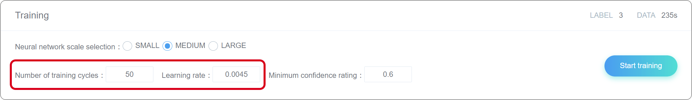

#### 1. Epoch/Number of Training Cycles

Number of Training Cycles are also called epoch. As a rule of thumb, you take your training data in small batches and feed it to your algorithm. A time period marked by feeding the whole of your training data set to the model is known as an epoch.
1.1 Set 'Number of training cycles' to `1`. This will limit training to a single iteration and then click Start training.

1.2 Now change 'Number of training cycles to `2` and you'll see performance goes up. Finally, change  the 'Number of training cycles' to `100` or more and let the training to finish.

This epochs number is an important hyperparameter for the algorithm. It specifies the number of epochs or complete passes of the entire training dataset passing through the training or learning process of the algorithm. With each epoch, the internal model parameters of the dataset are updated.

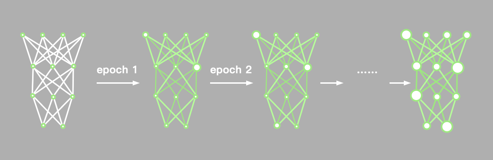

#### 2. Learning Rate

The learning rate is a hyperparameter that controls the changes to the model in response to the estimated error each time the model weights are updated. Choosing the learning rate is challenging because if the value is too small, it may result in a long training process whereas a too large value may result in learning a sub-optimal set of weights too fast or an unstable training process.
The learning rate is the most important hyperparameter when configuring your neural network. Therefore it is vital to know how to investigate the effects of the learning rate on model performance and to build an intuition about learning rate on model behavior.
Just take our perfect model as the bottom of the valley, the learning rate is each pace we take to go to our target.

1. Learning rate is too low: We don't know when we can reach our target and we may reach a "fake" valley.
2. Good learning rate: It takes the proper time to reach the desired goal.
3. High learning rate: We always miss our way to get into the valley's entry.
4. Learning rate is Very High : Poor behavior.

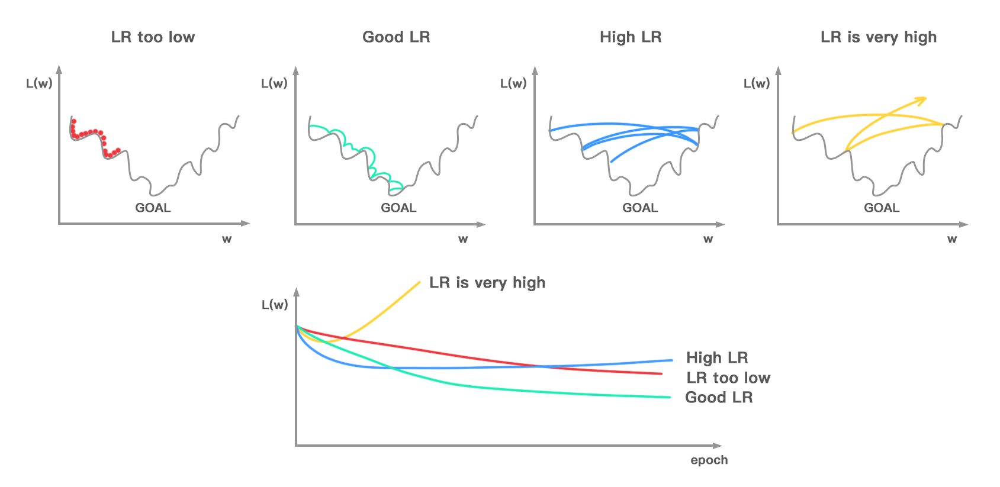

## Summarization

1. Theroy:

- Gas sensor

2. TinyML practice

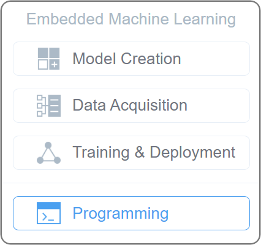

3. ML theory(Hyperparameter)

- The variables that determine the network structure
  1. Number of Hidden Units
  2. Number of Hidden Layers
- The variables which determine how the network is trained
  1. Number of Training Cycles/Epoch:  A time period marked by feeding the whole of your training data set to the model is known as an epoch.
  2. Learning Rate: Controls the changes to the model in response to the estimated error each time the model weights are updated.
