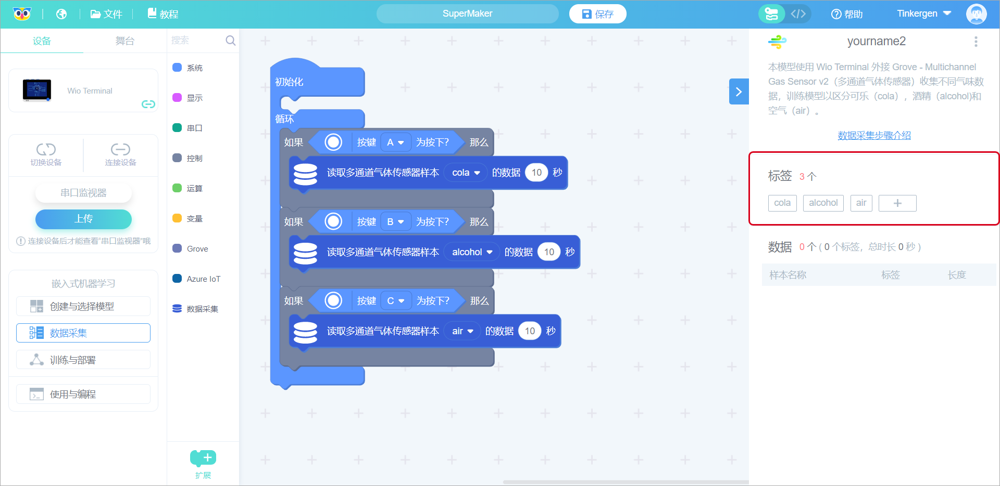

# 第5课 使用 Grove 多通道气体传感器进行气体识别

## 项目概述

在这个项目中，我们将制造一个人工智能鼻子，它是由机器学习模块构成，可以被训练用来区分可乐中的酒精，或者识别你想叫它闻到的任何东西。我们将使用 Wio Terminal 的外接 Grove 多通道气体传感器（Grove - Multichannel Gas Sensor v2）来收集不同的气味数据，并将其用于训练模型以区分可乐、酒精和空气。

这受到了[Benjamin Cabé 人工鼻子项目](https://twitter.com/kartben/status/1258791793073815552)的启发：

“我花了相当多的时间来试图完善我的面包配方，包括确定什么时候我的酵母发酵剂会处于理想状态，可以让我烤出完美的法棍。”凯布如是说。“几周后，我组装了一个完美的假鼻子。”

 所以在项目完成后，你也可以尝试组装自己的一个假鼻子来检测其他气味。

### 预期结果

期望的结果显示如下，Wio Terminal 能实时检测到当前的酒精或可乐并显示：

### 准备工作

硬件需求：

- Wio Terminal
- [Grove 多通道气体传感器](https://www.seeedstudio.com/Grove-Multichannel-Gas-Sensor-v2-p-4569.html)

连接方法：

**注意：**

在使用之前我们需要对传感器进行预热，以达到内部化学平衡，这样才能使我们更好的用传感器识别气体。建议传感器存储时间和相应的预热时间如下：

| 传感器存储时间 | 建议的预热时间 |
| --- | --- |
| 少于1个月 | 不少于24小时 |
| 1-6个月 | 不少于48小时 |
| 超过6个月 | 不少于72小时 |

## 背景知识

气体传感器使用 MEMS（Micro-Electro-Mechanical Systems）工艺，也就是在硅底板上嵌入在**清洁空气**中导电率低的半导体材料（金属氧化物），以此来制造微热板，所以当传感器暴露在有特定气体气味的环境中，传感器的电导率会随着空气中的气体浓度升高而升高。这种电导率的变化可以通过一个简单的电路转换来把对应的气体浓度换作电信号输出。

Grove 多通道气体传感器有4个测量单元，每个测量单元对各种气体都很敏感，这意味着我们可以同时获得四组数据，因为识别的气体里有着不同种类的气体，我们就可以通过这四组数据来判断。传感器可检测一氧化碳(CO)、二氧化氮(NO2)、乙醇(C2H5OH)、挥发性有机化合物(VOC)等多种气体。

如上图所示的酒和可乐，气体传感器在检测到其气体的含量和组合的值时是具有一定特征的，而这组特征值就可以让我们用来建立一个机器学习模型以识别不同物质排放的气体。

## 练习与实践

### 课程步骤

1. 创建与选择模型
1. 数据采集
1. 训练与部署
1. 使用与编程

### 步骤1、创建与选择模型

#### 1.1 建立“气体识别（Grove 多通道气体传感器）”模块

点击“创建与选择模型”，然后点击“外接多通道气体传感器识别味道”，如下面步骤 1 和步骤 2 所示：

​

给新建的模型命名。

点击“确认”就会自动跳转到数据采集界面。

### 步骤 2、 数据采集

#### 2.1 默认标签

#### 2.2 连接设备并上传 Codecraft 中的默认数据采集程序

Wio Terminal 连接后，在 Codecraft 界面，点击"上传"即可上传默认数据采集程序。

#### 2.3 数据采集

在右上角的超链接中，您将找到数据采集的分步介绍。请按照说明收集数据。

注意：

- Wio Terminal 按钮位置。
- 动画是已经加速过的，实际动作可能有所缓慢。
- 请注意红色提示。
- 将光标指向描述文本以获得更详细的内容。

​

数据全部采集完成。

单击“训练与部署”。

### 步骤 3. 训练与部署

#### 3.1 设置神经网络和参数

选择你觉得合适的神经网络规模：小型、中型、大型。

接着设置参数、训练周期数（正整数）、学习率（从 0 到 1 的数字）和最小置信度（从 0 到 1 的数字）。初始页面已提供一些默认参数值。

在这里我们使用选择的规模为中，这会耗一段时间。

#### 3.2 开始训练模型

点击“开始训练”。

当您点击“开始训练”时，界面会显示“拼命加载中...”。

“拼命加载中...”的持续时间取决于所选神经网络的规模（小型、中型、大型）和训练周期数。通常来说，网络规模和训练周期数越大，所需的时间就越长。

#### 3.3 观察模型性能，选择理想模型

在“模型训练报告”窗口中，您可以观察训练结果，包括模型的准确率、损失和性能。

如果训练结果不理想，您随时可以回到第一步训练模型，选择另一个大小的神经网络，调整参数训练等，直到得到一个结果满意的模型。

#### 3.4 部署理想模型

在“模型训练报告”窗口中，点击“模型部署”。

等到部署完成后，点击“确认”即可跳转到“使用与编程”窗口。

### 步骤 4. 使用与编程

#### 4.1 编写使用模型的程序

在“使用编程”界面，点击“模型使用”以调用部署的模型。

您可以尝试通过编写以下程序来调用您的模型。

#### 4.2 将程序上传到 Wio Terminal

单击“上传”按钮。

第一次上传时间通常比较长，并且随着模型的复杂性时间会进一步增加。较小型号的上传时间约为 4 分钟，较大型号可能会消耗更长时间，这取决于您机器的性能。

#### 4.3 Wio Terminal 测试模型

将你的 Grove 多通道气体传感器靠近可乐来看看 Wio Terminal 是否会显示“可乐”，再尝试一下其他的饮料，看看Wio Terminal 是否可以识别。

**恭喜你!您已经完成了第四个 TinyML 模型。相信你已经尝试设置过参数（parameters），训练循环次数(training cycles)，学习率(learning rate)和最小置信度(minimum confidence rating)，然而这些参数是如何影响我们的模型性能的？**

 **那现在就让我们开始学习这些神奇的参数吧。**

## 机器学习理论(超参数)

### 超参数（Hyperparameters）

超参数在我们训练我们的神经网络模型的时候尤为重要，在训练前设置合适的超参数可以优化权重和偏差。它可以分为：

- 决定神经网络结构的变量
      1. 隐藏单元数
      1. 隐藏层数
- 决定神经网络如何训练的变量
      1. 训练周期/时期数
      1. 学习速率

在上节课中，我们学习了决定神经网络结构的变量。在这节课中，我们将学习决定神经网络训练的变量。

#### 1. 训练周期的次数

训练周期数也被称为 Epoch，一个 Epoch 代表着将整个训练数据集输入模型进行一次训练的时间，很多情况下一个 Epoch 会对计算机负担很重，我们可以小批量地将训练数据输入到算法中，这样子就可以减少其负荷。

我们可以自己尝试观察训练周期数的对模型训练的影响：

**1.1** 将神经网络模型设置“训练周期数”为 “1”。这样就会限制训练只有单个迭代，然后单击“Start training”，观察结果。

**1.2** 接着将“训练周期数”改为“2”，观察结果你会发现模型性能得到提高。最后，试着将“训练周期数”改为 “100”或更多，尝试让机器完成并输入其他测试集来观察结果。

 Epoch 是算法的一个重要超参数。Epoch 的值具体代表的是训练数据集完整输入到机器学习模型中，对模型算法进行训练的次数。所以对于每个 Epoch，模型内部参数都会被更新且模型会更加拟合训练数据集里的点，但可能你也会发现，训练太多次之后反而训练出来的模型会有大的偏差，即模型太过于拟合训练集而无法对测试集作出令人满意的预测和分类。

选择合适的训练周期次数也是极其重要的。

#### 2. 学习率

学习率是一个超参数，在每次模型权重更新时，都可以通过它来调整模型权重以减少误差。选择学习率是同样具有挑战性的，如果学习率过小，训练时间就会过长，而过大的学习率则可能导致学习过快从而只能达到次优值而非最优值，也可能导致训练过程不稳定。

在训练神经网络模型时，学习率是最重要的超参数。因此，研究学习率对模型性能的影响，以及拥有能判断出符合模型性能的最佳学习率的直觉也是非常重要的。

 学习率就相当于我们完成训练模型要走的步伐，我们既不想把步伐迈大了忽略了很多数据集的点，也不想迈小了导致我们要走的时间非常长，同时还可能误判“最优解”的值。

如上图所示，如果没有选到合适的学习率，将会带来一系列问题：

   1. 学习率太高：我们总是错过进入山谷最低（最优解）的路。
   2. 学习率太低：我们不知道什么时候能达到目标，时间消耗太长，并且我们可能会达到一个“假”的最低山谷，也就是假“最优解”。
   3. 良好的学习率：经过适当的时间就达到预期的目标。
   4. 不断降低的学习率：一步一步调整到达预期的目标。

## 总结

1. 背景理论知识：

- 气体传感器

2. 嵌入式机器学习实践

3. 决定网络结构的变量
   - 隐藏单元数
   - 隐藏层数

决定网络如何训练的变量

- 训练周期数：将整个训练数据集输入模型的时间段称为 Epoch
- 学习率：在每次更新模型权重时，根据估计误差控制对模型的更改

​
