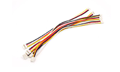

# No-code Programming to Get Started with TinyML

> Designed to introduce beginners to the basics of Embedded Machine Learning with Wio Terminal and Codecraft graphical programming.

## Hello World of AI

[Seeed Studio](https://www.seeedstudio.com/) released a feature in June 2021: **[Hello World of AI](https://www.seeedstudio.com/wio-terminal-tinyml.html)**, where [Codecraft](https://ide.tinkergen.com/https:/) Graphical Programming for TinyML and a number of TinyML projects using [Wio Terminal](https://www.seeedstudio.com/Wio-Terminal-p-4509.htmlhttps:/) were introduced and demonstrated. TinkerGen is the team responsible for educational products at Seeed Studio, and we believe that Codecraft's support for TinyML is of great importance, as it significantly lowers the barrier for users to learn and use TinyML technology. Without having to deal with a complex programming environment and knowledge of algorithms, users can start collecting data, training models and programming deployments for TinyML projects easily and quickly through browsers and graphical programming.
To this end, the team has written the TinyML with Wio Terminal Free Course for Beginners and made it available for download as a PDF. To help more users and educational institutions use and promote this exciting technology. We have further open sourced the entire course on GitHub.

## Course Overview

Learn how to train and deploy deep neural network models on Cortex-M core microcontroller devices like Wio Terminal using a graphical programming tool know as Codecraft. Course content features seven detailed step-by-step projects that allow the students to grasp basic ideas about modern Machine Learning and how it can be used in microcontrollers with low-power consumption and smaller footprint to create intelligent, connected systems. After completing this course, students will be able to design and implement their own Machine Learning enabled projects on Cortex-M core microcontrollers starting from defining a problem to gathering data and training neural network models. Finally deploying it to the device to display inference results or control other hardware appliances based on inference data.

Course contents are based on the use of Codecraft which simplifies data collection, model training, and conversion pipeline.

> 👀️ This course does not require knowledge of programming or electronics. It will take you step-by-step through the necessary knowledge and quickly put it into practice in each project.

## Course Requirements

* Hardware requirements (boards, modules):

|                                             |                                                                                      |                                                                 |                                                                                       |
| :-------------------------------------------------------------------------- | ------------------------------------------------------------------------------------------------------------------- | ---------------------------------------------------------------------------------------------------------------- | ------------------------------------------------------------------------------------------------------------------------------------- |
| [Wio Terminal](https://www.seeedstudio.com/Wio-Terminal-p-4509.html) × 1 | [Grove cables](https://www.seeedstudio.com/Grove-Universal-4-Pin-20cm-Unbuckled-Cable-5-PCs-Pack-p-749.html) × 4 | [Grove - Multichannel Gas Sensor v2](https://www.seeedstudio.com/Grove-Multichannel-Gas-Sensor-v2-p-4569.html) | [Grove - Thermal Imaging Camera](https://www.seeedstudio.com/Grove-Thermal-Imaging-Camera-IR-Array-MLX90640-110-degree-p-4334.html) |

* Software requirements (possible platform or language): [Codecraft](https://ide.tinkergen.com)

  

### The general steps of each project are as follows

1. Project Overview: An introduction to the project objectives to be accomplished in the lesson and the results to be achieved.
2. Background knowledge: The lesson will begin with an introduction to the new hardware and its electrical knowledge.
3. Practices:
   1. Model Creation
   2. Data Acquisition
   3. Training & Deployment
   4. Programming
4. ML Theory

### ML knowledge

1. Understand your input: input labels, dataset.
2. Understand your output: output, training performance.
3. Know the different model scales.
4. Know the Hyperparameter.
5. Model assessments.
6. Learn to improve the training performance.
7. Advanced knowledge of neural network: layers and their details.

### Curriculum outline

| Name                                                                                     | Overview                                                                                                                                                                            | Hardware                                                                                                                                                                                                            |
| ------------------------------------------------------------------------------------------ | ------------------------------------------------------------------------------------------------------------------------------------------------------------------------------------- | --------------------------------------------------------------------------------------------------------------------------------------------------------------------------------------------------------------------- |
| **Getting started**                                                                      |                                                                                                                                                                                     |                                                                                                                                                                                                                     |
| [Lesson 01 Introduction to TinyML using Wio Terminal and Codecraft](Lesson-01/README.md) | The basic theory of TinyML / Introduction of Wio Terminal and grove / Get started with Codecraft                                                                                    | [Wio Terminal](https://www.seeedstudio.com/Wio-Terminal-p-4509.html)                                                                                                                                                |
| **Projects**                                                                             |                                                                                                                                                                                     |                                                                                                                                                                                                                     |
| [Lesson 02  Motion Recognition by using built-in accelerometer](Lesson-02/README.md)                | Theory: Introduction of the accelerometer / Practice: Model creation > Data Acquisition > Training & Deployment > Programming / ML Theory(Understand your input）                   | [Wio Terminal](https://www.seeedstudio.com/Wio-Terminal-p-4509.html)                                                                                                                                                |
| [Lesson 03 Gestures Recognition by using built-in Light sensor](Lesson-03/README.md)                              | Theory: Introduction of the light sensor / Practice: Model creation > Data Acquisition > Training & Deployment > Programming / ML Theory(Understand your input）                    | [Wio Terminal](https://www.seeedstudio.com/Wio-Terminal-p-4509.html)                                                                                                                                                |
| [Lesson 04 Wake-up Words Recognition by using built-in microphone](Lesson-04/README.md)                           | Theory: Introduction of the microphone / Practice: Model creation > Data Acquisition > Training & Deployment > Programming / ML Theory (Model scale:SMALL,MEDIUM and LARGE)         | [Wio Terminal](https://www.seeedstudio.com/Wio-Terminal-p-4509.html)                                                                                                                                                |
| [Lesson 05 Smell recognition by using Grove-Multichannel Gas Sensor](Lesson-05/README.md)                         | Theory: Introduction of the Multi-channel Gas Sensor / Practice: Model creation > Data Acquisition > Training & Deployment > Programming / ML Theory (Hyperparameter)               | [Wio Terminal](https://www.seeedstudio.com/Wio-Terminal-p-4509.html) [Grove - Multichannel Gas Sensor v2](https://www.seeedstudio.com/Grove-Multichannel-Gas-Sensor-v2-p-4569.html)                                 |
| **Advanced Projects**                                                                    | Coming soon                                                                                                                                                                         |                                                                                                                                                                                                                     |
| Lesson 06 Sport recognition by using built-in accelerometer                              | Theory: Introduction of sport recognition / Practice: Model creation > Data Acquisition > Training & Deployment > Programming / ML Theory (Model assessments)                       | [Wio Terminal](https://www.seeedstudio.com/Wio-Terminal-p-4509.html)                                                                                                                                                |
| Lesson 07 Barcode recognition by built-in light sensor                                   | Theory: Introduction of the barcode / Practice: Model creation > Data Acquisition > Training & Deployment > Programming / ML Theory (Improve model)                                 | [Wio Terminal](https://www.seeedstudio.com/Wio-Terminal-p-4509.html)                                                                                                                                                |
| Lesson 08 Face Recognition with the thermal imaging sensor                               | Theory: Introduction of thermal imaging sensor,Face Recognition / Practice: Model creation > Data Acquisition > Training & Deployment > Programming / ML Theory (Details of layers) | [Wio Terminal](https://www.seeedstudio.com/Wio-Terminal-p-4509.html) [Grove - Thermal Imaging Camera (MLX90640)](https://www.seeedstudio.com/Grove-Thermal-Imaging-Camera-IR-Array-MLX90640-110-degree-p-4334.html) |
| **Summarization**                                                                        | Coming soon                                                                                                                                                                         |                                                                                                                                                                                                                     |
| Lesson 09 Summarization and Creative projects                                            | Summarization of ML theory / Examples of creative projects                                                                                                                          |                                                                                                                                                                                                                     |

## PDFs

You can [download](./pdf/No-code_Programming_to_Get_Started_with_TinyML.pdf) the PDF version of this course.

## Help Wanted

Would you like to contribute a translation? Please read our [translation guidelines](TRANSLATIONS.md) and add input [to one of the translations issues](https://github.com/microsoft/IoT-For-Beginners/issues?q=is%3Aissue+is%3Aopen+label%3Atranslation). If you want to translate into a new language, please raise a new issue for tracking.
