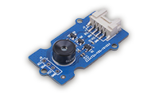

# 图形化编程之嵌入式机器学习入门 —— 用 Wio Terminal 玩转 TinyML

> 本课程旨在通过 Wio Terminal 和图形化编程工具 Codecraft 向初学者介绍嵌入式机器学习（TinyML）的基础知识。

## Hello World of AI

[Seeed Studio](https://www.seeedstudio.com/) 于2021年6月发布了一个专题：[Hello World of AI](https://www.seeedstudio.com/wio-terminal-tinyml.html)，在这个专题上介绍了图形化编程工具 [Codecraft](https://ide.tinkergen.com) 已支持嵌入式机器学习（TinyML），并展示了使用和  [Wio Terminal](https://www.seeedstudio.com/Wio-Terminal-p-4509.html) 进行嵌入式机器学习的项目。TinkerGen （在中国称为柴火创客教育）是 Seeed Studio 负责教育产品的团队，我们认为 Codecraft 对 TinyML 的支持有着非常重大的意义，它极大的降低了用户学习和使用 TinyML 技术的门槛。用户不需要面对复杂的编程环境，算法知识，就能通过浏览器和图形化编程，简单快速的开始着手为 TinyML 项目采集数据、训练模型和编程部署。
为此，团队撰写了《图形化编程之嵌入式机器学习入门 —— 用 Wio Terminal 玩转 TinyML》课程，并以 PDF 的方式提供给用户下载。为了能帮助更多的用户和教育机构，使用和推广这一另人激动人心的技术。我们进一步在 GitHub 上开源了整个课程。

## 课程基本信息

此课程意在让学生了解并使用 Codecraft 的图形编程工具在 Wio Terminal 上编程，进而进行训练和部署深度神经网络模型。它包含七个详细的逐步递进的课程项目，让学生能掌握嵌入式机器学习的基本概念，并且懂得如何将其用于低功耗而尺寸更小的微控制器以创建智能化、相互连接的系统。完成本课程后，学生将能够在以 Cortex-M  为核心的微控制器上设计并实践他们自己的嵌入式机器学习项目，从定义问题到收集数据进而训练神经网络模型，再到最后将其部署到设备上以显示推理结果，或者根据推理数据控制其他硬件设备，这些都可以自己完成。

Codecraft 的使用，使得数据收集、模型训练的流程得到了简化，基本的过程分为以下4个步骤。

|                               |                                                                         |                              |                                                        |
| :-------------------------------------------------------------------------- | ------------------------------------------------------------------------------------------------------------------- | ------------------------------------------------------------------------------------------------------------- | ----------------------------------------------------------------------------------------------------------------------------- |
| 第1步：创建与选择模型 | 第2步：数据采集 | 第3步：训练与部署 | 第4步：使用智能算法编程 |

> 👀️ 本课程并不需要编程或电子相关的知识，它将带您从零开始逐步掌握必要的知识，并在每个项目中快速得到实践。

## 课程所需资源

* 硬件需求 ：

|                               |                                                                         |                              |                                                        |
| :-------------------------------------------------------------------------- | ------------------------------------------------------------------------------------------------------------------- | ------------------------------------------------------------------------------------------------------------- | ----------------------------------------------------------------------------------------------------------------------------- |
| [Wio Terminal](https://www.seeedstudio.com/Wio-Terminal-p-4509.html) × 1 | [Grove 连接线](https://www.seeedstudio.com/Grove-Universal-4-Pin-20cm-Unbuckled-Cable-5-PCs-Pack-p-749.html) × 4 | [Grove - 多通道气体传感器模块 v2](https://www.seeedstudio.com/Grove-Multichannel-Gas-Sensor-v2-p-4569.html) | [Grove - 热成像相机模块](https://www.seeedstudio.com/Grove-Thermal-Imaging-Camera-IR-Array-MLX90640-110-degree-p-4334.html) |

* 软件需求：[Codecraft](https://ide.tinkergen.com)

  

### 项目的一般步骤如下

1. 项目概述：介绍课程中要完成的项目目标及需要得到的结果。
2. 背景知识：介绍所要用到的新硬件及其相关的知识。
3. 练习与实践：
   1. 创建与选择模型
   2. 数据采集
   3. 训练与部署
   4. 使用与编程
4. 项目有关的嵌入式机器学习理论知识

### 机器学习知识

1. 了解输入：输入标签、数据集
2. 了解输出：输出结果、训练表现
3. 了解不同的模型比例
4. 了解超参数
5. 对模型进行评估
6. 学习提高模型训练效果
7. 神经网络的进阶知识：层（也叫 layer）及其知识

### 课程要求

| 名称                                                                                          | 概述                                                                                                                                    | 硬件                                                                                                                                                                                                                 |
| ----------------------------------------------------------------------------------------------- | ----------------------------------------------------------------------------------------------------------------------------------------- | ---------------------------------------------------------------------------------------------------------------------------------------------------------------------------------------------------------------------- |
| **入门**                                                                                      |                                                                                                                                         |                                                                                                                                                                                                                      |
| [第1课 使用 Wio Terminal 和 Codecraft 学习 TinyML](../Lesson-01/translations/README.zh-cn.md) | TinyML 的基础理论知识 / Wio Terminal 和 Grove 的介绍 / 开始使用 Codecraft                                                               | [Wio Terminal](https://www.seeedstudio.com/Wio-Terminal-p-4509.html)                                                                                                                                                 |
| **初级项目**                                                                                  |                                                                                                                                         |                                                                                                                                                                                                                      |
| [第2课 使用内置加速度计进行运动识别](../Lesson-02/translations/README.zh-cn.md)            | 背景知识：加速度计的原理介绍 / 练习与实践：创建与选择模型 > 数据采集 > 训练与部署 > 使用与编程 / 机器学习理论（输入标签，数据集）       | [Wio Terminal](https://www.seeedstudio.com/Wio-Terminal-p-4509.html)                                                                                                                                                 |
| [第3课 使用内置光线传感器进行手势识别](../Lesson-03/translations/README.zh-cn.md)          | 背景知识：光线传感器的原理介绍 / 练习与实践：创建与选择模型 > 数据采集 > 训练与部署 > 使用与编程 / 机器学习理论（输出，训练表现）       | [Wio Terminal](https://www.seeedstudio.com/Wio-Terminal-p-4509.html)                                                                                                                                                 |
| [第4课 使用内置麦克风识别唤醒词](../Lesson-04/translations/README.zh-cn.md)                | 背景知识：麦克风的原理介绍 / 练习与实践：创建与选择模型 > 数据采集 > 训练与部署 > 使用与编程 / 机器学习理论（不同的模型比例）           | [Wio Terminal](https://www.seeedstudio.com/Wio-Terminal-p-4509.html)                                                                                                                                                 |
| [第5课 使用 Grove 多通道气体传感器进行气味识别](../Lesson-05/translations/README.zh-cn.md) | 背景知识：气体传感器的原理介绍 / 练习与实践：创建与选择模型 > 数据采集 > 训练与部署 > 使用与编程 / 机器学习理论（超参数）               | [Wio Terminal](https://www.seeedstudio.com/Wio-Terminal-p-4509.html)，[Grove - Multichannel Gas Sensor v2](https://www.seeedstudio.com/Grove-Multichannel-Gas-Sensor-v2-p-4569.html)                                 |
| **进阶项目**                                                                                  | 即将推出                                                                                                                                |                                                                                                                                                                                                                      |
| 第6课 人体动作识别                                                                            | 背景知识：运动识别的原理介绍 / 练习与实践：创建与选择模型 > 数据采集 > 训练与部署 > 使用与编程 / 机器学习理论（模型评估）               | [Wio Terminal](https://www.seeedstudio.com/Wio-Terminal-p-4509.html)                                                                                                                                                 |
| 第7课 使用内置光线传感器识别条码                                                              | 背景知识：条码的原理介绍 / 练习与实践：创建与选择模型 > 数据采集 > 训练与部署 > 使用与编程 / 机器学习理论（提高模型训练效果）           | [Wio Terminal](https://www.seeedstudio.com/Wio-Terminal-p-4509.html)                                                                                                                                                 |
| 第8课 使用热成像传感器进行人脸识别                                                            | 背景知识：热成像传感器原理介绍及人脸识别 / 练习与实践：创建与选择模型 > 数据采集 > 训练与部署 > 使用与编程 / 机器学习理论（层 - layer） | [Wio Terminal](https://www.seeedstudio.com/Wio-Terminal-p-4509.html)，[Grove - Thermal Imaging Camera (MLX90640)](https://www.seeedstudio.com/Grove-Thermal-Imaging-Camera-IR-Array-MLX90640-110-degree-p-4334.html) |
| **总结**                                                                                      | 即将推出                                                                                                                                |                                                                                                                                                                                                                      |
| 第9课 创意项目和总结                                                                          | 机器学习理论知识总结 / 创意项目的例子                                                                                                   |                                                                                                                                                                                                                      |

## 获取课程的 PDF 版本

你可以 [下载](../pdf/No-code_Programming_to_Get_Started_with_TinyML.zh-cn.pdf) 本课程的 pdf 版本。

## 我们需要你的帮助

你愿意提供翻译吗？请阅读我们的 [翻译指南](TRANSLATIONS.md) ，在 [翻译问题列表](https://github.com/TinkerGen/No-code-Programming-to-Get-Started-with-TinyML/issues?q=is%3Aissue+is%3Aopen+label%3Atranslation) 里留言。如果你想翻译成一种新的语言，请在提出一个新的 issue 以便进行跟踪。

## 再创作支持

我们支持并鼓励您用本课程进行再创作，比如出版书籍，把它改写为自己 STEAM 课程的教案，或做成在线视频课……如果在再创作过程中，您需要支持，或希望在此处分享你的创作成果，都可以[和我们联络](mailto:contact@chaihuo.org)。
